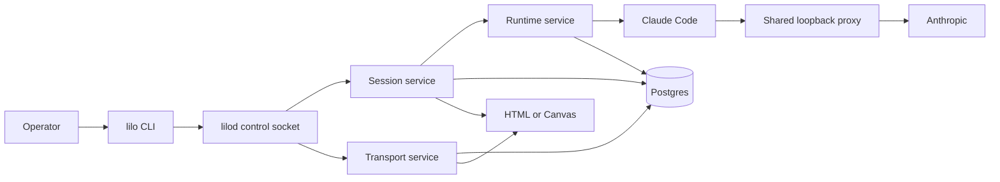

# Little Organs first Transport and Canvas proof

## Decision

Implement Transport as a Rust service inside the existing `lilod` process.
Add two private crates:

1. `internal/transport/core`, package `lilo-transport-core`.
2. `internal/transport/service`, package `lilo-transport-service`.

The core crate owns Transport contracts, typed IDs, states, redacted read
models, RPC types, and the Session-facing port. The service crate owns the
loopback proxy, the Claude Messages adapter, Postgres queries, immutable
evidence, disclosure, recovery, and deterministic HTML rendering.

Do not add a Transport binary, app crate, driver crate, Python helper, or
separate daemon. Keep the store as a private service module. Extract a store
crate after storage gains a second consumer or an independent release or test
boundary.

This design is grounded at repository commit
`c2864d01952929e1bdb6e382b7abf059fdde7bff` and GitHub issue 37.

## Current state

The current product composes Session and Runtime in one `lilod` process.
`internal/session/app/src/compose.rs` opens one `LiloDb`, builds both services,
and binds one local control socket. Session calls Runtime through
`RuntimePort`. Production uses `InProcessRuntime`.

Session spawn has two database transactions around the Runtime side effect:

1. Transaction A records authorization, the pending spawn intent with the
   complete Runtime request, and Runtime `Forking`.
2. Runtime starts the process and returns readiness evidence.
3. Transaction B inserts the running Session, commits the Runtime `Running`
   lifecycle again, and resolves the intent.
4. Session publishes the Runtime event after transaction B commits.

`LaunchAttachment` already exists on Runtime `SpawnRequest`. Session still
sets it to `None`. Runtime retains a present attachment through
`RuntimeService::spawn`, but it never copies the attachment into `LaunchSpec`,
the shim, the child environment, or a file.

Transport and Canvas have no implementation on this commit.

## Target system



`internal/session/app/src/compose.rs` stays the sole production composition
root. Startup order is:

1. Open `LiloDb`.
2. Build `TransportService` and bind one shared loopback listener.
3. Build `RuntimeService`.
4. Build `SessionService` with in-process Runtime and Transport ports.
5. Reconcile Transport records and pending Session intents.
6. Bind the existing `lilod` control socket.

Shutdown stops Session tasks, then Runtime children, then Transport. Transport
must remain available while a child can still send provider traffic. The shared
database closes last.

Issue 39 should remove `SessionServiceContext::from_env` before the new
composition wiring lands. That keeps `compose.rs` as the visible construction
owner.

## Operator loop

The first proof covers one Claude Messages request:

```text
lilo run claude
  -> Session mints SessionId and authorizes
  -> Transport prepares required capture in transaction A
  -> Session persists the complete Runtime request
  -> Runtime launches Claude with Transport launch environment
  -> Transport captures and holds the first Messages request
  -> operator opens the first-turn report
  -> operator edits one tool description by tool name
  -> Transport validates and forwards
  -> Claude receives the provider response
  -> report shows original, forwarded, response, and audit evidence
```

The HTML proof uses explicit navigation. `lilo run` prints the exact
`lilo transport report <session>` command. A static HTML report contains no
command server. Edit and forward operations remain typed `lilo transport`
commands over the existing `lilod` socket. Canvas later provides the interactive
renderer over the same read and command contracts.

## Launch preparation

The attachment cannot route Claude because Runtime does not deliver it to the
child. Transport preparation therefore returns one atomic launch patch:

```rust
pub struct PreparedCapture {
    pub attachment: LaunchAttachment,
    pub env: Vec<LaunchEnv>,
}

impl PreparedCapture {
    pub fn install(self, request: &mut RuntimeSpawnRequest) -> Result<(), InstallError>;
}
```

`install` consumes the patch. It checks the `SessionId` and Runtime kind,
rejects an existing attachment, applies one shared environment merge helper,
and sets the attachment. Session never reads the environment keys or attachment
value.

Transport starts one listener at `127.0.0.1:0` when `lilod` starts. For a
Claude launch, `PreparedCapture.env` sets:

```text
ANTHROPIC_BASE_URL=http://127.0.0.1:<bound-port>
ANTHROPIC_CUSTOM_HEADERS=X-Lilo-Session-Id: <SessionId>
```

Claude Code documents both variables for gateway routing. Transport merges any
existing custom headers and rejects a case-insensitive collision with its
internal header. The proxy strips `X-Lilo-Session-Id` before forwarding. The
header is a local routing value, not an authorization credential.

Transport also preserves the original upstream base URL before it replaces the
child value. It rejects a credential-bearing URL. Provider credential headers
pass through memory and are never stored as evidence.

Do not depend on URL path-prefix behavior. Claude Code does not document that
contract.

### Docker boundary

The first proof supports host execution. `127.0.0.1` inside a container points
at the container, so Docker capture needs a separate host-routing design.
Transport fails preparation for unsupported isolation. It never launches an
uncaptured proof Session.

## Transaction and recovery model

Transport binds the shared listener before Session accepts work. Capture
preparation then performs only database work and deterministic value creation.
It can join Session transaction A.

The revised transaction A order is:

1. Begin the shared `LiloTransaction`.
2. Authorize the Session spawn with `IdentityClient::authorize_in_tx`.
3. Call `TransportPort::prepare_capture_in` with the same transaction.
4. Install the returned attachment and environment on the Runtime request.
5. Insert the Transport capture row.
6. Insert the pending Session intent with the complete Runtime request.
7. Insert Runtime `Forking`.
8. Commit.

A rollback removes the capture record, the intent, the audit, and the lifecycle
together. No socket or task starts inside the transaction.

Pending intent recovery reuses the persisted Runtime request. It never prepares
a second capture. Transport validates that the capture row matches the
attachment and `SessionId`. A missing or conflicting capture fails closed and
causes Session orphan cleanup.

If Runtime spawn fails, one compensation transaction aborts the Session intent
and the Transport capture. If transaction B fails after Runtime starts, Session
terminates the orphan and aborts the capture with the same evidence.

A held provider connection cannot survive a `lilod` crash. Startup reconciliation
classifies the durable turn by its commitment evidence. Transport records a safe
precommit failure, a postcommit failure, or `CommitmentUnknown`. Transport never
retries provider traffic.

## Code organization

```text
internal/transport/
  core/
    src/
      lib.rs
      error.rs
      id.rs
      launch.rs
      port.rs
      projection.rs
      proto.rs
      state.rs
  service/
    src/
      lib.rs
      authz.rs
      capture.rs
      disclosure.rs
      proxy.rs
      recovery.rs
      report.rs
      service.rs
      store.rs
      claude/
        mod.rs
        messages.rs
        model.rs
```

The modules group owned knowledge. They do not model execution stages as
separate public layers.

### Dependency direction

```text
lilo-common       lilo-rm-core       lilo-im-core
      \                |                  /
       +------ lilo-transport-core ------+
                    ^       ^
                    |       |
        lilo-transport-service     lilo-wire
                    ^
                    |
             lilo-session-app
                    |
             lilo-session-daemon
```

`lilo-transport-core` depends on `lilo-common`, `lilo-rm-core`, Identity
contract types, Serde, and `thiserror`. It does not depend on Session, Runtime,
SQLx, or `lilo-wire`.

`lilo-transport-service` depends on core, `lilo-db`, SQLx, the Identity
service, Tokio, and one private HTTP server and client stack. It does not depend
on Session, Runtime daemon, Runtime store, or `lilo-wire`.

`lilo-wire` adds `LilodRpc::Transport(TransportRpc)` and depends on Transport
core. Session daemon depends on Transport core through `Arc<dyn TransportPort>`.
Session app depends on the concrete Transport service for composition.

Runtime gains no Transport dependency.

## Service seams

### Session port

```rust
pub trait TransportPort: Send + Sync {
    fn prepare_capture_in(
        &self,
        tx: &mut LiloTransaction<'_>,
        request: PrepareCapture,
    ) -> TransportFuture<'_, PreparedCapture>;

    fn capture_projection(
        &self,
        session_id: SessionId,
    ) -> TransportFuture<'_, Option<CaptureProjection>>;

    fn abort_capture_in(
        &self,
        tx: &mut LiloTransaction<'_>,
        session_id: SessionId,
        reason: AbortReason,
    ) -> TransportFuture<'_, ()>;
}
```

The transaction-aware method is an in-process v1 contract. A future process
split must replace it with a durable coordination protocol. The first proof
does not prebuild that protocol.

### Control RPC

`TransportRpc` owns:

```text
GetCapture
EditToolDescription
ForwardHeld
CancelHeld
ReadRaw
RenderHtml
```

Edit and forward requests carry `TurnId`, `expected_revision`, and the expected
original description digest. Duplicate tool names, stale revisions, digest
mismatches, and missing tools fail while the request remains held.

Transport authorizes projected read, raw read, edit, forward, and cancel actions
inside `TransportService::handle_rpc`. Session spawn authorization covers the
internal prepare operation.

### Session joined read model

Session owns the user-level result:

```rust
pub struct SessionDetail {
    pub session: Session,
    pub capture: Option<CaptureProjection>,
}
```

Session loads its row and asks `TransportPort` for the redacted projection.
Session never reads Transport tables. No `session_capture_links` table is
needed because Transport already keys captures by `SessionId`.

## Domain model

Separate state axes prevent contradictory combinations:

```rust
pub enum RoutingState {
    Prepared,
    Active,
    Released,
    Lost,
}

pub enum TurnPhase {
    AwaitingRequest,
    Held,
    CommitIntent,
    Streaming,
    Terminal,
}

pub enum MutationState {
    Unchanged,
    Edited,
}

pub enum TurnOutcome {
    Complete,
    FailedBeforeCommitment,
    FailedAfterCommitment,
    CommitmentUnknown,
    Expired,
}

pub enum CommitmentEvidence {
    None,
    IntentPersisted,
    RequestBytesWritten { bytes: u64 },
    ResponseBytesDelivered { request_bytes: u64, response_bytes: u64 },
    TerminalSuccess { request_bytes: u64, response_bytes: u64 },
}
```

An invalid edit returns a validation result and leaves the turn `Held`.
Unchanged pass through is a mutation result. Neither becomes a competing phase.

One proxy task owns each captured turn. RPC handlers authorize commands and
send decisions to that task. The proxy task is the sole writer for validation,
forwarding, response chunks, commitment, and the terminal outcome.

The default hold timeout is 540,000 ms. Preparation requires it to remain below
the resolved Claude `API_TIMEOUT_MS`. A timeout records
`FailedBeforeCommitment` and returns a local failure to Claude.

## Provider adapter

Transport stores the exact captured request body before it exposes the held
turn. For an unchanged forward, Transport sends the stored body bytes without a
JSON round trip.

For a named edit, the Claude adapter:

1. Parses the original body into a raw JSON tree.
2. Locates exactly one tool by semantic name.
3. Checks the turn revision and original description digest.
4. Changes only the tool description.
5. Validates the resulting Claude Messages request.
6. Serializes the modified raw tree.
7. Records every changed field with its disposition, reason, and adapter
   revision.

Unknown fields stay in the raw tree. A changed request can alter lexical JSON
formatting, but it must preserve every unknown value. The audit proves the
allowed semantic difference.

## Persistence

The service module owns four logical tables in the unified Postgres migration:

| Table | Purpose |
| --- | --- |
| `transport_captures` | `CaptureId`, `SessionId`, provider, routing state, attachment facts, listener generation |
| `transport_turns` | `TurnId`, capture, phase, outcome, revision, commitment counts, observed identity |
| `transport_evidence_blobs` | append-only original, curated, forwarded, and ordered response body bytes with length and digest |
| `transport_audit_facts` | append-only field, edit, validation, disclosure, identity, commitment, and failure facts |

Add `CaptureId` and `TurnId` through the existing `lilo-common` typed ID macro.
Provider request IDs stay observed strings with source and confidence. Do not add
a platform `RequestId` until a Little Organs record needs one.

Canonical evidence means exact provider payload body bytes and ordered response
chunks. It excludes encrypted TLS records and credential-bearing HTTP headers.
Transport stores selected nonsecret HTTP facts separately.

Canonical blobs are immutable. Every Canvas, HTML, log, diagnostic, export, MCP
resource, and event projection uses one Transport disclosure policy. A
projection records the canonical digest, the disclosure revision, and each
redaction fact. Projections never replace canonical blobs.

The first proof retains Transport evidence until `lilo delete session` removes
the Session. HTML remains regenerable under the temporary directory. No long
term index, export store, or background retention service enters this slice.

## Product locks for issue 37

| # | Decision | Lock |
| --- | --- | --- |
| 1 | Provider | Claude Messages only. Codex bypasses Transport. |
| 2 | First request | Hold until explicit forward, cancel, or timeout. |
| 3 | Edit lifetime | One request-scoped edit selected by tool name. |
| 4 | Capture failure | Required and fail closed. No uncaptured proof launch. |
| 5 | Navigation | Explicit report command printed by `lilo run`. |
| 6 | Report hierarchy | Interpreted view first. Raw body is an authorized drill down. |
| 7 | Redaction and retention | One disclosure policy. Canonical bodies live until Session deletion. Credentials are never evidence. |
| 8 | Delivery order | Deterministic HTML first, then Canvas on the same contracts. |
| 9 | Language and process | Rust service inside `lilod`, one shared listener. |
| 10 | Table ownership | Transport owns its tables. Session joins through the port. |
| 11 | Interpretation audit | Record source, destination, disposition, reason, and adapter revision for each changed field. |
| 12 | Identity | `SessionId` is authoritative. Provider and client claims retain source, precedence, confidence, ambiguity, and collisions. |
| 13 | Canonical evidence | Immutable body bytes. All display forms are disclosed projections. |
| 14 | Commitment | Distinguish precommit failure, postcommit failure, and unknown crash windows. Transport never retries. |

## Four executable proof cases

Each case drives the composed `lilod` service against a local synthetic
Anthropic endpoint.

1. **Unchanged request.** Original and forwarded body bytes match. An unknown
   sentinel field reaches the endpoint unchanged. Response chunks preserve
   order. One terminal outcome exists.
2. **Named tool edit.** One description changes. Unknown fields survive. The
   audit contains the allowed mutation, field facts, and adapter revision.
3. **Failure before commitment.** The endpoint receives zero bytes. Transport
   records `FailedBeforeCommitment`. No retry occurs.
4. **Failure after commitment.** The endpoint accepts request bytes and returns
   one response chunk before disconnecting. Transport stores the partial bytes
   and records `FailedAfterCommitment`. No retry occurs.

The verifier also corrupts one stored digest and proves that verification fails
for that exact blob.

## Delivery sequence

1. Close issue 39 and update the governing architecture documents with the
   launch environment patch, transaction A preparation, canonical byte
   definition, and fourteen product locks.
2. Add `lilo-transport-core`, typed IDs, state transitions, RPC contracts, and
   projection fixtures.
3. Add `lilo-transport-service`, the four tables, transaction tests, disclosure,
   and recovery tests.
4. Add the shared loopback proxy and the Claude adapter. Prove unchanged bytes,
   unknown field preservation, one named edit, timeout, and commitment states.
5. Wire Session transaction A, compensation, pending intent recovery,
   `LilodRpc::Transport`, composition, and shutdown. Runtime receives only
   preservation tests.
6. Add `lilo transport` commands and deterministic HTML from
   `CaptureProjection`.
7. Add Canvas against the same RPC models. Canvas opens no database or file
   store.

Each implementation issue runs `just check && just build && just test` plus its
direct composed runtime proof. Workspace changes also run
`fmm generate && fmm validate`.

## Blocker before implementation

The governing documents still say that Transport returns only one launch
attachment and place capture preparation before transaction A. They do not
define canonical provider bytes precisely enough for a terminating HTTP proxy.

Before code starts, update `docs/architecture/system.md` and
`docs/architecture/transport.md` to lock:

1. `PreparedCapture` returns the opaque attachment and a typed launch
   environment patch.
2. Database-only preparation joins Session transaction A.
3. Canonical provider bytes mean body bytes and ordered body chunks. Credential
   headers remain transient.
4. Host execution is the first proof. Unsupported Docker capture fails closed.

## Sources

Repository sources:

* `internal/session/app/src/compose.rs`, `run_core` and `handle_connection`.
* `internal/session/daemon/src/handler/spawn.rs`, `spawn`,
  `begin_spawn_intent`, `complete_spawn_intent`, and `spawn_launch`.
* `internal/session/daemon/src/service.rs`, `SessionServiceContext` and
  `SessionService::build`.
* `internal/session/driver/src/port.rs`, `RuntimePort`.
* `crates/lilo-rm-core/src/types/spawn.rs`, `LaunchAttachment` and
  `SpawnRequest`.
* `crates/lilo-rm-core/src/launcher.rs`, `LaunchEnv` and `LaunchSpec`.
* `internal/wire/src/lib.rs`, `LilodRpc`.
* `internal/db/src/lib.rs`, `LiloDb` and `LiloTransaction`.
* `docs/architecture/system.md`.
* `docs/architecture/transport.md`.
* `docs/architecture/canvas.md`.
* `docs/architecture/review/cliproxyapi-lessons-for-first-transport-proof.md`.
* [GitHub issue 37](https://github.com/littleorgans/littleorgans/issues/37).

External contracts:

* [Claude Code environment variables](https://code.claude.com/docs/en/env-vars).
* [Claude Code gateway configuration](https://code.claude.com/docs/en/llm-gateway).

