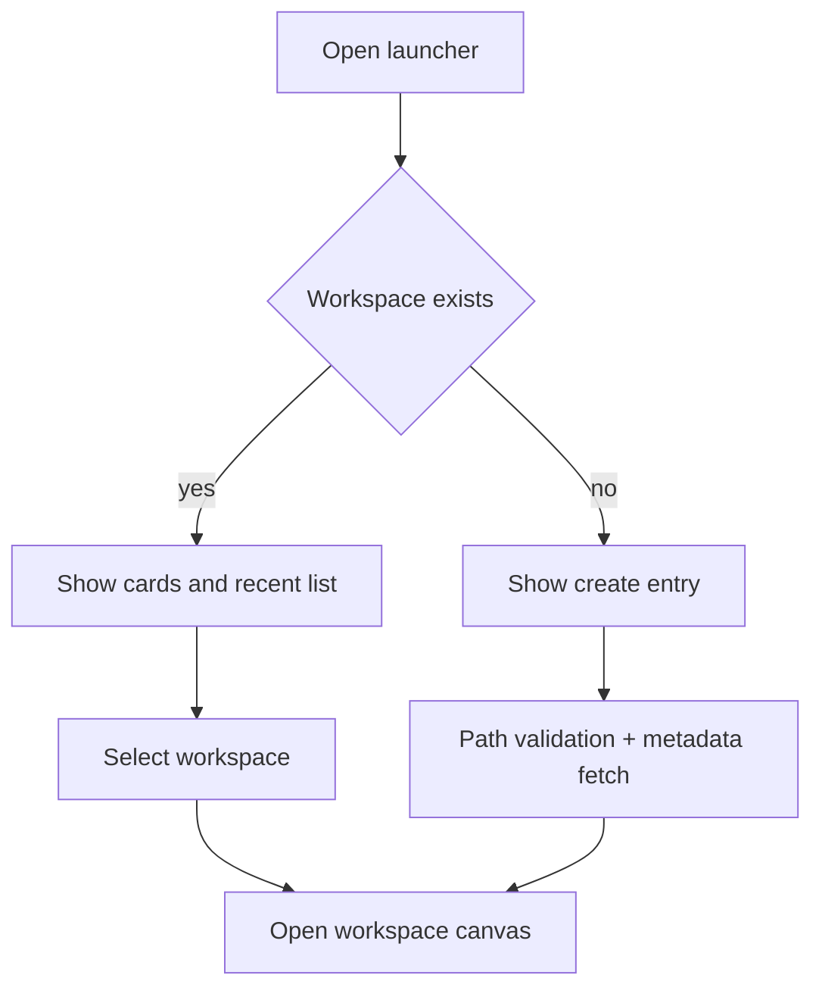

# Transport Matters Desktop Cockpit / Layout Lab UX Specification (frontend contract)

## 1. Summary

This spec applies the charter requirements from
`/Users/alphab/.mdx/projects/transport-matters-desktop-cockpit/CHARTER.md` to a buildable user experience contract for the desktop cockpit.

Goals:
- Define the generic layout engine interaction model as the first class feature.
- Keep Transport Matters content as adapters to that engine, not inside the engine.
- Deliver tmux like control patterns for experts while keeping mouse flows clear for newcomers.
- Enforce calm motion for artifacts, focus safety, and provenance discoverability.

Research basis:
- tmux style split workflows for fast navigation and split operations are the baseline for the target users.
- Existing repo keyboard patterns in the web UI use route based keystroke handling and leader prefixes, which should be reused in desktop.
- WCAG 2.1 AA expectations are the accessibility anchor for all interactive behaviors.
- Apple Human Interface guidance on focus and motion and Material style principles for hierarchy inform transition rhythm.

Design risk callout:
- The workspace identity model is inherited from current backend logic (`workspace_id` and `workspace_root` in `api/src/transport_matters/workspace.py`), so workspace selection and persistence must reflect `slug + hash` exactly.

---

## 2. Design System Foundation

### 2.1 Semantic color tokens

Use CSS custom properties only. No hardcoded values in components.

```css
:root {
  /* Canvas and layering */
  --tm-canvas: var(--color-canvas, #080808);
  --tm-surface: var(--color-surface, #0e0e0e);
  --tm-raised: var(--color-raised, #171717);
  --tm-hover: var(--color-hover, #1f1f1f);
  --tm-edge: var(--color-edge, #242424);
  --tm-edge-subtle: var(--color-edge-subtle, #171717);

  /* Text */
  --tm-text: var(--color-txt, #dcdcdc);
  --tm-text-muted: var(--color-txt-2, #949494);
  --tm-text-subtle: var(--color-txt-3, #707070);
  --tm-text-on-accent: #0b0b0b;

  /* Intent colors */
  --tm-success: #7ec9a0;
  --tm-warning: #d4b07e;
  --tm-error: #d4879c;
  --tm-notice: #7ab3d4;
  --tm-live: #f0ede4;

  /* Focus and accents */
  --tm-accent: var(--color-accent, #e8e4dc);
  --tm-accent-rgb: var(--accent-rgb, 232 228 220);
  --tm-focus-ring: 2px solid rgb(var(--tm-accent-rgb) / 0.75);

  /* Transitions */
  --tm-duration-fast: 120ms;
  --tm-duration-normal: 220ms;
  --tm-duration-base: 260ms;
  --tm-duration-long: 420ms;
  --tm-ease-emph: cubic-bezier(0.16, 1, 0.3, 1);
  --tm-ease-soft: cubic-bezier(0.2, 0, 0.1, 1);

  /* Geometry */
  --tm-radius: 0px;
  --tm-border-width: 1px;
  --tm-gap: 8px;

  /* Layout */
  --tm-sidebar: 340px;
  --tm-canvas-min: 320px;
  --tm-artifact-zone: 340px;

  /* Elevation */
  --tm-shadow-soft: 0 1px 0 0 rgb(0 0 0 / 0.45), 0 10px 25px -16px rgb(0 0 0 / 0.55);
  --tm-shadow-focus: 0 0 0 1px rgb(var(--tm-accent-rgb) / 0.45), 0 0 0 5px rgb(var(--tm-accent-rgb) / 0.12);

  /* Typography tokens */
  --tm-font-stack: var(--font-sans, "JetBrains Mono", ui-monospace, SFMono-Regular, Menlo, Consolas, monospace);
  --tm-fs-12: 12px;
  --tm-fs-13: 13px;
  --tm-fs-14: 14px;
  --tm-fs-16: 16px;
  --tm-lh-tight: 1.22;
  --tm-lh-body: 1.45;
  --tm-lh-code: 1.2;

  /* Spacing scale, base 4 */
  --tm-space-0: 0;
  --tm-space-1: 4px;
  --tm-space-2: 8px;
  --tm-space-3: 12px;
  --tm-space-4: 16px;
  --tm-space-5: 20px;
  --tm-space-6: 24px;
  --tm-space-8: 32px;
  --tm-space-10: 40px;
  --tm-space-12: 48px;
  --tm-space-16: 64px;

  --tm-z-base: 1;
  --tm-z-overlay: 20;
  --tm-z-modal: 40;
  --tm-z-tooltip: 60;
}
```

### 2.2 Spacing and grid scale

The layout engine assumes half modular increments and a fixed toolbar density.

| token | px |
| --- | --- |
| --tm-space-1 | 4 |
| --tm-space-2 | 8 |
| --tm-space-3 | 12 |
| --tm-space-4 | 16 |
| --tm-space-5 | 20 |
| --tm-space-6 | 24 |
| --tm-space-8 | 32 |

Grid:
- Container width clamps at `min(100vw - 24px, 1920px)` on wide screens.
- In wide layout, canvas uses full available space with left launcher rail and right artifact dock.

### 2.3 Typography

| token | value |
| --- | --- |
| body | var(--tm-font-stack), var(--tm-fs-13), --tm-lh-body |
| label | var(--tm-font-stack), 11px, uppercase letter spacing .15em |
| code | var(--tm-font-stack), var(--tm-fs-13), --tm-lh-code |

### 2.4 Motion policy

- Enter transitions: 220 ms base, 420 ms long with easing.
- Exit transitions: 180 ms.
- Reduce motion: obey `prefers-reduced-motion: reduce` and switch to opacity and color only.
- No element steals focus in animation unless explicit focus command completes.

```css
@media (prefers-reduced-motion: reduce) {
  * {
    animation-duration: 1ms !important;
    transition-duration: 1ms !important;
    transition-delay: 0ms !important;
  }
}
```

---

## 3. Component Specifications

### 3.1 Core data contracts

```ts
export type LayoutMode = "tiling" | "canvas";
export type Axis = "row" | "column";

export type PaneKind =
  | "transcript"
  | "terminal"
  | "wire"
  | "artifact"
  | "agentSummary";

export interface PaneDescriptor {
  id: string;
  kind: PaneKind;
  title: string;
  agentId: string;
  workspaceId: string;
  runId: string;
  contentSource: "transcript" | "wire" | "terminal" | "artifact";
  provenance: ProvenanceRef;
  createdAt: string;
  locked: boolean;
  loading: boolean;
}

export interface ProvenanceRef {
  agentId: string;
  runId: string;
  turnId: string;
  route: "transcript" | "wire" | "tool";
  path?: string;
}

export interface SplitLeaf {
  kind: "leaf";
  paneId: string;
  size: number; // flex fraction 0.05 to 0.95
}

export interface SplitNode {
  kind: "split";
  id: string;
  axis: Axis;
  ratio: number; // 0.1 to 0.9 for main split handle
  first: SplitLeaf | SplitNode;
  second: SplitLeaf | SplitNode;
}

export interface LayoutTree {
  root: SplitLeaf | SplitNode;
  mode: LayoutMode;
  selectedPaneId: string;
  zoomPaneId: string | null;
}

export interface ArtifactItem {
  id: string;
  type: "image" | "markdown" | "json" | "text" | "unknown";
  title: string;
  path: string;
  mime: string;
  createdAt: string;
  sourceTurnId: string;
  sourceAgentId: string;
  workspaceId: string;
  updatedAt?: string;
  dedupeKey: string;
  pinned: boolean;
  dismissed: boolean;
}
```

### 3.2 Workspace launcher card component

**Purpose and context**

The initial screen shows existing workspaces and metadata, then opens a persisted canvas.

**TypeScript props**

```ts
export interface WorkspaceMeta {
  workspaceId: string; // slug/hash
  slug: string;
  rootPath: string;
  branch: string | null;
  gitDirty: boolean;
  lastActivityAt: string | null;
  liveAgentCount: number;
  canvasThumbUrl?: string;
}

export interface WorkspaceLauncherProps {
  workspaces: WorkspaceMeta[];
  recentWorkspaces: WorkspaceMeta[];
  loading: boolean;
  error: string | null;
  selectedWorkspaceId: string | null;
  onSelect: (workspaceId: string) => void;
  onCreateWorkspace: (path: string) => void;
  onForgetWorkspace: (workspaceId: string) => void;
  onRenameAlias: (workspaceId: string, alias: string) => void;
  onOpenPath: (path: string) => void;
  openMode: "projectGallery" | "commandPalette" | "dragFolder";
}
```

**State matrix**

| State | Visual
| --- | --- |
| default | card shows `--tm-surface` and subtle border, metadata in secondary tone |
| hover | border and background raise to `--tm-raised`, row glow on project name |
| active | brief pressed visual using `transform: scale(0.99)` for click affordance |
| focus | focus ring `--tm-focus-ring`, keyboard tooltip style ring visible |
| disabled | muted text and disabled icon, no pointer events |
| loading | shimmer skeleton and busy icon, action controls disabled |
| error | error badge, retry action, optional inline alert |
| empty | placeholder card with help copy and primary action |

**Responsive behavior**

- `< 768`: single column cards, command palette hidden behind top bar button.
- `768-1023`: two column card grid.
- `1024+`: card grid plus side rail metadata.

**Accessibility**

- Role `button` for cards with `aria-label` containing workspace slug and branch.
- Enter and space activate selection.
- Command palette has `role="listbox"` plus filtering by text and keyboard arrows.

**Animations**

- On first render, cards fade in from 100ms stagger.
- On open to canvas, selected card scales down into full-screen transform.

### 3.3 Workspace launcher option card

The charter allows 2 to 3 approaches. This spec recommends **project gallery** as primary with command palette as secondary and drag folder as tertiary.

- `projectGallery`: persistent grid with branch and path metadata.
- `commandPalette`: for power flow, activated by `Ctrl+K` and first class for operators.
- `dragFolder`: optional zone with file picker fallback.

### 3.4 Workspace list and open flow



### 3.5 Layout canvas

**Purpose and context**

The layout shell hosts all agent and artifact panes for one workspace.

**TypeScript props**

```ts
export interface LayoutCanvasProps {
  workspaceId: string;
  mode: LayoutMode;
  tree: LayoutTree;
  panes: Record<string, PaneDescriptor>;
  artifactDock: ArtifactItem[];
  zoomPaneId: string | null;
  onTreeChange: (tree: LayoutTree) => void;
  onPaneFocus: (paneId: string) => void;
  onPaneSplit: (paneId: string, axis: Axis, ratio: number) => void;
  onPaneMerge: (paneId: string) => void;
  onModeChange: (mode: LayoutMode) => void;
  onZoomToggle: (paneId: string | null) => void;
  onArtifactSpawn: (artifact: ArtifactItem) => void;
}
```

**State matrix**

| State | Visual |
| --- | --- |
| default | tree renders recursively from `LayoutTree`, non focused panes at baseline |
| hover | split handles and pane edges brighten with `--tm-text-subtle` contrast |
| active | focused pane gets raised border and top badge |
| focus | keyboard focus ring around focused pane shell |
| disabled | tree interaction blocked if no run is active |
| loading | ghost node placeholders while run streams first render |
| error | canvas shows non blocking inline alert, preserves shell and selected pane |
| empty | empty canvas prompt for spawning first agent |
| loading | loading and focus states can overlap during agent start |

**Responsive behavior**

- `<768`: canvas uses single column stack first and shows only one full pane at a time with quick jump tabs.
- `768-1023`: pane stack plus compact split handles.
- `1024+`: full recursive split with live drag handles.

**Accessibility**

- Every pane shell has `tabIndex={0}` and accessible label `Workspace agent pane, kind, focus state`.
- `Ctrl+Alt+Arrow` keys for focus order.
- Layout mode and zoom state are announced through `aria-live="polite"` status region.

**Motion**

- Every layout transform uses FLIP: measure old rect, apply inverse transform, then animate to new rect.
- Preset switch: 260 ms for normal, 420 ms for showpiece mode transition to `canvas`.

### 3.6 Split handle

**Purpose and context**

Provides proportional layout control in tiling mode.

**TypeScript props**

```ts
export interface SplitHandleProps {
  axis: Axis;
  ratio: number;
  minPercent: number;
  maxPercent: number;
  onChange: (ratio: number) => void;
  onSplitReset: () => void;
}
```

**State matrix**

| State | Visual |
| --- | --- |
| default | 4px separator with subtle edge |
| hover | highlight and cursor hint (`col-resize` or `row-resize`) |
| active | drag state with pressed color and temporary inset overlay |
| focus | focus ring and keyboard nudge hint |
| disabled | no drag cursor |
| loading | skip resize while snapshot reflow is active |
| error | handle disabled and tooltip `Resize not available` |
| empty | hidden |
| loading | (state overlap) handles disabled for all panes during transition |

**Accessibility**

- Use arrow key nudges with 5 percent increments; `Shift` increments 1 percent.
- `Home` and `End` reset to even split and 80-20 preset.

**Animation**

- Value changes are eased with `cubic-bezier(.2,0,.15,1)` over 180 ms.

### 3.7 Pane shell

**Purpose and context**

Wraps terminal, transcript, wire and artifact surface.

**TypeScript props**

```ts
export interface PaneShellProps {
  pane: PaneDescriptor;
  isFocused: boolean;
  isZoomed: boolean;
  isPinned: boolean;
  status: "idle" | "loading" | "error" | "stale";
  onClose: (paneId: string) => void;
  onTogglePin: (paneId: string) => void;
  onOpenProvenance: (pane: PaneDescriptor) => void;
  onFocus: (paneId: string) => void;
  onMove: (paneId: string, direction: "up" | "down" | "left" | "right") => void;
}
```

**State matrix**

| State | Visual and behavior |
| --- | --- |
| default | neutral shell, label row with kind tag |
| hover | header buttons appear with opacity transition |
| active | shell border and background raised to focus gradient |
| focus | persistent focus ring and active title dot |
| disabled | dimmed and interaction blocked |
| loading | shimmer in body, spinner in header |
| error | red status chip plus retry button |
| empty | empty state placeholder with action `spawn` |

**Responsive behavior**

- `<768`: header collapses to icon only; long titles truncate with tooltip.
- `>=768`: full labels and toolbar actions visible.

**Accessibility**

- Use `<section>` with `aria-labelledby`.
- Error messages use assertive region for non persistent errors only.

### 3.8 Preset switcher

**Purpose and context**

Select tiling and free canvas modes and major split presets.

**TypeScript props**

```ts
export interface PresetSwitchProps {
  mode: LayoutMode;
  preset: "main-vertical" | "main-horizontal" | "grid" | "even";
  onModeChange: (mode: LayoutMode) => void;
  onPresetChange: (preset: "main-vertical" | "main-horizontal" | "grid" | "even") => void;
  disabled: boolean;
}
```

**State matrix**

| State | Visual |
| --- | --- |
| default | baseline selected preset marker on active mode |
| hover | candidate preset glows |
| active | pressing updates selected icon then animates tree |
| focus | keyboard focus ring on currently selected button |
| disabled | entire control locked |
| loading | disabled until transition completes |
| error | inline message with fallback to last preset |
| empty | none shown in no workspace view |
| loading | state transitions include reduced contrast fallback |

**Accessibility**

- Single tab stop group with `aria-label="Layout presets"`.
- Selected state via `aria-pressed`.

### 3.9 Artifact lane and tile

**Purpose and context**

Spawn and host artifact viewers without breaking operator focus. Dedupe and update same artifact path.

**TypeScript props**

```ts
export interface ArtifactLaneProps {
  artifacts: ArtifactItem[];
  focusedArtifactId: string | null;
  onSelectArtifact: (artifactId: string) => void;
  onDismissArtifact: (artifactId: string) => void;
  onPinArtifact: (artifactId: string) => void;
  onRetrySpawn: (artifact: ArtifactItem) => void;
  onOpenArtifact: (artifact: ArtifactId) => void;
}

export interface ArtifactTileProps {
  artifact: ArtifactItem;
  isFocused: boolean;
  isPinned: boolean;
  onClick: () => void;
  onDismiss: () => void;
  onPinToggle: () => void;
  onOpenProvenance: () => void;
}
```

**State matrix**

| State | Visual |
| --- | --- |
| default | muted dock row card |
| hover | lift and highlight |
| active | border changes to accent and opens preview |
| focus | focus ring and provenance button visible |
| disabled | no click and low contrast |
| loading | skeleton icon and spinner, no focus steal |
| error | error chip and retry action |
| empty | calm empty dock with guidance copy |
| loading | updates in place for dedupe-to-update |

**Responsive behavior**

- `<768`: artifact lane collapses to horizontal strip with max two rows.
- `1024+`: vertical dock right panel with grouped cards.

**Accessibility**

- `ArtifactLane` is a live region that announces artifact count changes.
- Each artifact card has `aria-label` including provenance turn and path.

### 3.10 Artifact dedupe update behavior

- `dedupeKey` derives from canonical path + normalized artifact type.
- On matching key, reuse existing pane and update source content.
- If type is unknown, file extension determines placeholder viewer.
- Pinned artifact stays visible even if process emits more updates.

### 3.11 Provenance action

**Purpose and context**

Jump from artifact to producing turn and agent.

**TypeScript props**

```ts
export interface ProvenanceActionProps {
  source: ProvenanceRef;
  onNavigate: (source: ProvenanceRef) => void;
}
```

- Use breadcrumb `agent / run / turn` in one line.
- Keyboard `p` opens provenance for focused artifact.

### 3.12 Keyboard command surface

Use modifier command mode and direct shortcuts.

```ts
// Core command map
Ctrl+K: open launcher palette or search bar
Ctrl+J: focus canvas
Ctrl+Shift+L: spawn agent panel
Ctrl+H/J/K/L: focus left/down/up/right pane
Ctrl+Z: zoom focused pane
Ctrl+Shift+Z: restore layout
Ctrl+Shift+S: open save preset
Ctrl+M: toggle mode tiling/canvas
Ctrl+Shift+T: open artifact dock
Esc: clear command mode and clear modal focus traps
```

Implementation note:
- Ignore shortcuts in terminal content editable zones.
- Keep key map discoverable in help overlay.

---

## 4. Interaction Patterns

### 4.1 Layout transition choreography

1. Measure current layout rects for each pane and dock.
2. Apply new tree and create clone set for FLIP.
3. Start transition by reversing from new to old.
4. Animate over 260 ms with `cubic-bezier(.2,0,.15,1)`.
5. Settle over 60 ms with minor alpha settle.

Mode switch rule:
- Tiling to canvas: fade background, expand root, then unproject panes to free world positions.
- Canvas to tiling: gather free positions, compute snap grid, then settle into recursive splits.

Artifact arrival:
- Artifact tile animates from source pane corner toward dock with 180 ms distance and 220 ms fade.
- No focus movement. Dock lane gets non focus style only.

### 4.2 Form and validation behavior

- Workspace path and agent name input validate on blur and submit.
- Invalid path: inline helper text and blocked `Enter`.
- Duplicate workspace: warning with action `Open existing session`.
- Command palette: no destructive action on Enter unless confirmation appears.

### 4.3 Dialog and modal patterns

- Confirmations: remove pane, remove artifact, clear local state.
- Use destructive style and explicit cancel.
- On confirm use async state with inline spinner.

### 4.4 Toast and notification system

- Channel levels: info, success, warning, error.
- Position near canvas top right.
- Default timeout 3 s info, 5 s warning, 8 s error persistent.
- Group repeated artifact spawn notices by path.

### 4.5 Empty states

- Workspace launcher empty: card with path entry field and command explanation.
- Canvas empty: single call to action "Spin one agent" and provider selector.
- Artifact dock empty: "No artifacts yet. Live artifacts appear here." with small animation.

---

## 5. Information Architecture and Navigation

### 5.1 Top level layout for desktop

- Left rail: workspace metadata and quick actions.
- Main area: workspace canvas.
- Right dock: artifact zone.
- Global top bar: mode switches, run stats, and live connection state.

### 5.2 Navigation map

```text
Launcher
  ├─ Recent list
  ├─ Search / filter
  ├─ Create workspace
  └─ Project card actions

Workspace canvas
  ├─ Canvas bar
  │   ├─ Preset controls
  │   ├─ Agent spawn
  │   └─ Layout mode
  ├─ Split tree
  │   ├─ Transcript pane
  │   ├─ Terminal pane
  │   └─ Wire pane
  └─ Artifact dock
      ├─ live artifacts
      ├─ dismissed collapsed list
      └─ provenance jump
```

### 5.3 Breakpoint behavior

- `mobile` < 768: command mode only, no side docks.
- `tablet` 768-1023: canvas full width, dock collapses to overlay.
- `desktop` 1024-1439: full canvas plus compact dock.
- `wide` 1440+: full dock and workspace rail.

---

## 6. Rawness gradient implementation

Across one agent the vertical order is:
- Transcript at upper left, highest abstraction, cleaner style.
- Terminal in center, high fidelity and input enabled.
- Wire at lower right, rawest and densest visual complexity.

Interpretation:
- Font and contrast increase from transcript to wire.
- Toolbar density: transcript has richer labels, wire has compact technical metadata.
- Background bloom and texture intensity increases toward wire.
- This gradient should be configurable by theme tokens so later products can flip ordering.

---

## 7. Accessibility requirements

### 7.1 Baseline
- Minimum 4.5:1 color contrast on all readable body text.
- Focus is always visible using `:focus-visible` ring.
- All interactive controls have accessible names and state text.
- Motion preference support with reduced motion mode.
- Status updates use `aria-live` in polite or assertive channels.

### 7.2 Keyboard matrix

| Pattern | Requirement |
| --- | --- |
| Focus movement | `Ctrl + H/J/K/L` or arrow fallback |
| Split operations | `Ctrl + Alt + Left/Right/Up/Down` |
| Zoom toggle | `Ctrl + Z` focus, `Esc` restore |
| Preset access | `Ctrl + M` mode, `Ctrl + Shift + [` preset 1, etc. |
| Artifact pin | `P` when artifact focused |

### 7.3 Screen reader behavior

- Layout changes announce `Preset changed to ...`.
- Artifact spawn announcements should include `new artifact` or `artifact updated` with source.
- Error messages in shell should avoid full JSON dumps. Use short summary and open details on demand.

---

## 8. Implementation roadmap

1. `01` foundation tokens and base atoms.
2. `02` launcher shell and workspace open flow.
3. `03` split tree model and canvas rendering.
4. `04` pane shell and command routing.
5. `05` terminal pane integration and resize bridge.
6. `06` artifact event channel and dock with dedupe.
7. `07` transitions, motion, accessibility pass, and contract tests.

Slice planning rule:
- Slice 1 keeps smallest end to end path: open launcher, spin one agent, show three TM content panes, show first layout preset switch.
- Each slice must include at least one focused end user test and one accessibility assertion.

---

## 9. Open questions for orchestrator

1. For preset persistence, should layout and dock collapse state save per workspace or per user session? Assumption: per workspace.
2. For artifact retention, should retired artifacts stay pinned for 24 hours by default or expire when workspace closes? Assumption: keep as long as workspace config persists.
3. For keyboard map, do we reserve `Ctrl+K` for launcher search and use a second key for command palette in future conflict with terminal plugins? Assumption: keep `Ctrl+K` in non terminal focus only.

