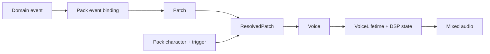

My assessment: **the package architecture is strong; the data model needs more work around identity, lifecycle, and the relationship between authored values and executable sound.** I would preserve the main package boundaries. I would address those model problems before adding substantial new functionality.

I reviewed checkout `10ba9fc16cea55271c6d428c8fe64c8df0b9c354` through source, configuration, and tests, without opening project documentation or README files. Type checking, all **270 tests**, linting, dependency structure verification, and the web build pass. I also ran targeted reproductions, which exposed several defects the existing tests miss. No tracked files changed.

The source currently describes an event driven procedural audio system with a shared authoring interface and executable acoustic checks. Its central model is:

This separation is a good foundation. An event describes something that happens. A pack chooses its sound. A patch contains authored synthesis data. Resolution applies trigger values and connections. Binding converts that result into the units and structures the renderer consumes.

The distinction between `Patch`, `ResolvedPatch`, and `Voice` is particularly valuable. It gives the authoring system and renderer different representations suited to their jobs. [Patch model](/Users/alphab/Dev/LLM/DEV/helioy/audioface-next/packages/contract/src/patch.ts:77), [voice binding](/Users/alphab/Dev/LLM/DEV/helioy/audioface-next/packages/patch/src/voice-binding.ts:63).

The most important findings concern the guarantees between those representations.

1. **A voice can fail admission after it has already changed runtime state.**

   I used the control API to set a tone to 12,000 Hz with a pitch ratio of 16. Both values are individually legal. The edit was accepted, and voice binding produced a 192,000 Hz source at a 48,000 Hz sample rate.

   The renderer correctly rejected that source. However, `MasterBus.start()` had already inserted the voice into its pool. The next render then failed with:

   > Audioface voice bad-pitch is in the pool with no signal path on the bus.

   This is the highest priority correctness issue. There are two related gaps: acceptance does not establish that the resulting voice can execute, and runtime admission does not commit atomically. A failed construction must leave the pool and its signal paths consistent. [Control acceptance](/Users/alphab/Dev/LLM/DEV/helioy/audioface-next/packages/control/src/surface.ts:65), [voice construction](/Users/alphab/Dev/LLM/DEV/helioy/audioface-next/packages/control/src/event-voice.ts:42), [bus admission](/Users/alphab/Dev/LLM/DEV/helioy/audioface-next/packages/engine/src/master-bus.ts:71).

2. **Patch ownership and patch identity disagree.**

   Packs embed a complete patch under each event. The editor converts those embedded objects into a map keyed only by `PatchId`.

   I constructed two events with different patches, one at 440 Hz and one at 880 Hz, sharing the same patch ID. Pack validation accepted them. The editor produced one target, and the first event subsequently played the second event’s 880 Hz patch.

   The model needs an explicit answer about ownership. Are patches independent values owned by event bindings, or shared entities referenced by several events? Either can work. The current representation permits independent values while the editor assumes shared identity, producing silent replacement. [Pack shape](/Users/alphab/Dev/LLM/DEV/helioy/audioface-next/packages/contract/src/pack.ts:19), [state construction and event reconstruction](/Users/alphab/Dev/LLM/DEV/helioy/audioface-next/packages/control/src/surface.ts:51).

3. **Deletion does not reliably end an entity’s identity.**

   Removing a layer leaves its addressed parameters and connections behind. New layer IDs are allocated by looking only at surviving layers, so an inserted layer can reuse a deleted layer’s ID.

   I set `layer-02` to 1,234 Hz, removed it, then inserted a new tone layer. The new layer became `layer-02` and inherited 1,234 Hz.

   Retaining inactive parameters can be useful when changing an existing layer’s source type. Deleting a layer requires a separate rule. Otherwise, old values and references can attach themselves to a newly created entity. This is a referential integrity problem in the flat parameter map. [Removal and insertion](/Users/alphab/Dev/LLM/DEV/helioy/audioface-next/packages/patch/src/patch-editing.ts:78), [ID allocation](/Users/alphab/Dev/LLM/DEV/helioy/audioface-next/packages/patch/src/patch-editing.ts:243).

4. **The control model does not fully distinguish authored, effective, and derived values.**

   Two reproductions illustrate this:

   - With pack character overriding patch gain to −10 dB, the editor accepted and displayed −20 dB while the voice still used −10 dB.
   - The editor accepted a patch duration of 2,000 ms while resolution recalculated it and the voice retained a 100 ms shape.

   Overlay precedence and derived values are reasonable mechanisms. The control manifest needs to communicate them. It currently lacks the information needed to explain which value is effective, where it came from, and whether a field is writable.

   This matters because the editor, HTTP API, CLI, and MCP all consume that same model. A missing distinction propagates consistently through every interface. [Snapshot values](/Users/alphab/Dev/LLM/DEV/helioy/audioface-next/packages/control/src/snapshot.ts:22), [manifest projection](/Users/alphab/Dev/LLM/DEV/helioy/audioface-next/packages/control/src/manifest.ts:48), [parameter metadata](/Users/alphab/Dev/LLM/DEV/helioy/audioface-next/packages/patch/src/registry/definition.ts:35).

5. **The authored structure suggests more routing freedom than the renderer supports.**

   A layer contains one ordered `processors` array. Binding partitions it into filters before the amplitude envelope and echoes after it. I confirmed that `[bandpass, delay]` and `[delay, bandpass]` produce identical `Voice` data.

   The actual execution model is:

   `source → filters → amplitude envelope/gain → echoes`

   That is a sensible synthesis chain. Its ordering should be explicit in the authored model. An ordered heterogeneous list otherwise suggests that moving a processor changes its position in the signal path.

   There is also an `envelopeSegments` collection that accepts structural entries, but no registered segment parameters or corresponding execution in the voice binder. This adds representational scope without implemented sound behavior. [Layer structure](/Users/alphab/Dev/LLM/DEV/helioy/audioface-next/packages/contract/src/patch.ts:41), [binding order](/Users/alphab/Dev/LLM/DEV/helioy/audioface-next/packages/patch/src/voice-binding.ts:90).

The flat parameter map itself is defensible. Stable addresses make generic editing, serialization, and generated controls straightforward. The registry centralizes ranges, defaults, units, authority, and response curves.

Its cost is that `Record<ParameterAddress, number | string | boolean>` cannot express which value type belongs at an address, whether its owner exists, or whether a combination of values can render. Most of that knowledge lives in runtime validators. I would retain the useful addressing scheme and strengthen the point where authored data becomes an executable voice. The current failures demonstrate that passing validation has several different meanings.

The runtime lifetime model is stronger. `playing`, `held`, and `released` are explicit variants, and held voices have no invented end time. Layer identities also participate in deterministic seed derivation, which helps keep random streams stable when existing layers are reordered. These are good domain decisions. [Lifetime types](/Users/alphab/Dev/LLM/DEV/helioy/audioface-next/packages/contract/src/voice.ts:74), [seed derivation](/Users/alphab/Dev/LLM/DEV/helioy/audioface-next/packages/contract/src/seed.ts:18).

The domain model currently has a narrower scope than its generic infrastructure might suggest:

- An event selects one patch and declares its voice class and sustain behavior.
- The public event path fixes velocity at `1` and variation at `0`, although the resolver supports both.
- `EmitterId` contributes to generated voice names, but the engine has no emitter entity or emitter lifecycle.
- Persistent playback is represented by a held voice. There is no separate sound instance that owns multiple triggers or voices over time.
- Placement consists of pan, width, and distance. A live placement command applies a common field to the bus’s voices.

These are scope boundaries, rather than automatic defects. Whether they are sufficient depends on what you intend to build. They are the main boundaries I would discuss with you before proposing additional abstractions. [Event construction](/Users/alphab/Dev/LLM/DEV/helioy/audioface-next/packages/control/src/event-voice.ts:42), [game interface](/Users/alphab/Dev/LLM/DEV/helioy/audioface-next/adapters/web/src/game-audio.ts:25).

The filesystem layout is coherent:

| Area | Assessment |
|---|---|
| `packages/contract` | Clear shared vocabulary, although it couples consumers to a broad set of authoring, runtime, and reporting concepts. |
| `packages/patch` | Appropriate home for authored data, registry, resolution, and binding. This is where most model complexity accumulates. |
| `packages/engine` | Focused DSP and voice lifecycle implementation, independent of packs and domain vocabulary. |
| `packages/content` / `packages/measure` | Useful separation between accepting content and measuring signals. |
| `packages/control` | A clear composition point for editing, audition, certification, and runtime hosting. |
| `domains` / `packs` / `catalogue` | A good split between event meaning, authored sounds, and the contents of a particular build. |
| `adapters` / `apps` | Platform translation is separated from small executable entry points. |

These boundaries are enforced by executable dependency checks. Measurement receives samples without pack identity, and adapters consume a shared control model. Those choices prevent meaningful classes of coupling. [Structure verifier](/Users/alphab/Dev/LLM/DEV/helioy/audioface-next/scripts/verify-structure.mjs:34), [measurement input](/Users/alphab/Dev/LLM/DEV/helioy/audioface-next/packages/measure/src/signal.ts:7).

File size is healthy: approximately 11,500 lines across 123 source files, including comments. The largest implementation file is 450 lines, and the longest source function I measured is 106 lines. I see no reason for a directory reorganization. Some package entry points export nearly every helper, so the public API is broader than the dependency diagram alone suggests.

Extensibility is strongest for **new sounds, packs, and platform interfaces**. The generic controls and existing interface/game domains provide useful evidence that content can vary without rewriting adapters.

Adding a new synthesis capability is more involved. Source and processor kinds are closed unions with corresponding registry, binding, and DSP implementations. A new kind requires coordinated changes across those layers. That is manageable for a deliberately bounded synthesizer. A general DSP module system would require a different extension contract.

Two further data concerns will matter as authoring grows. Editor revisions exist in memory, but HTTP and MCP edit requests do not carry the client’s expected revision; the server supplies a fresh snapshot itself. The internal stale revision protection therefore does not protect remote read, modify, write workflows. Also, certification stores readable strings and domain/pack names without a patch revision or content fingerprint, so a saved result cannot identify the exact authored state it certified. [Request handling](/Users/alphab/Dev/LLM/DEV/helioy/audioface-next/packages/control/src/outcome.ts:14), [certification shape](/Users/alphab/Dev/LLM/DEV/helioy/audioface-next/packages/contract/src/certification.ts:46).

I would keep the architecture and prioritize atomic voice admission, explicit patch ownership, deletion semantics, and truthful control values. Those improvements are justified by current behavior. Decisions about persistent sounds, emitters, routing graphs, or extensible DSP should follow our discussion of your intended product.

The verification here covers source behavior and Node execution, including the shared audio host. I built the browser application, but did not assess listening quality or real device timing.

<oai-mem-citation>
<citation_entries>
MEMORY.md:3-3|note=[Prior workspace context used to identify facts requiring fresh source verification]
MEMORY.md:24-24|note=[Prior module names used only to orient source inspection]
</citation_entries>
<rollout_ids>
01a06a57-3dfe-7150-a006-b765345700c1
</rollout_ids>
</oai-mem-citation>