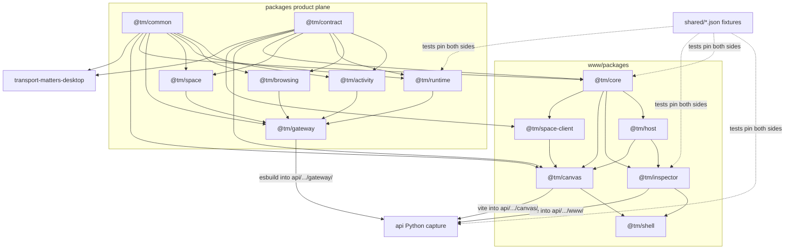
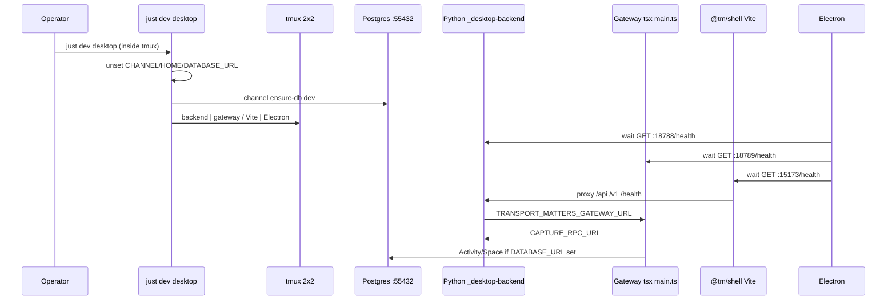

<!-- fmm:map sha=730aaa96 branch=fix/capture-only-canvas-runs dirty=false generated=2026-09-05 files=1862 loc=n/a -->
# MAP: shared infrastructure and toolchain

Orient a fresh agent that must change `packages/`, `shared/`, `scripts/`, `tests/`, or root tooling on the first attempt. Python capture (`api/`) and browser products (`www/`, `desktop/`) appear only where they consume this layer.

fmm index validated at SHA `730aaa96` (1862 files, clean). Claims below cite source. Line numbers are of this SHA.

Start here: `packages/AGENTS.md` for package kinds, `docs/ARCHITECTURE.md` for the two-plane rule, `docs/CHANNELS.md` for local state, `justfile` for the daily commands.

## Confidence and method

This map was built against a clean checkout at `730aaa96` with a current fmm index (`fmm validate` exit 0). Three Mermaid diagrams were renderer-validated with `mmdc`. No `just` recipe, test suite, or live stack was executed.

**Verified by reading both sides of a seam** (fixture or contract file plus the Python test plus the TypeScript test, or both package.json exports and the import-graph enforcer):

- All five `shared/*.json` files, with pin tests for descriptors (`api/src/transport_matters/harnesses/test_registry.py` and `www/packages/core/src/types/harnessDescriptors.test.ts`), inventory (`api/src/transport_matters/harnesses/test_inventory_vocabulary.py` and `www/packages/core/src/types/harnessInventory.test.ts`), model catalog (`api/src/transport_matters/harnesses/test_model_catalog.py` and `api/scripts/publish_model_catalog.py`), override targets (`api/src/transport_matters/overrides/test_targets.py` and `www/packages/inspector/src/lib/overrideTargets.test.ts`), and char accounting (`www/packages/inspector/src/lib/charAccounting.test.ts` plus the matching comments in `www/packages/inspector/src/lib/charAccounting.ts` and `api/src/transport_matters/overrides/audit.py`).
- Activity Postgres literals: `packages/activity/contracts/pg-contracts.json`, `packages/activity/src/adapters/postgresSchema.ts`, `api/src/transport_matters/session/test_activity_pg_contracts.py`.
- Channel table: `api/src/transport_matters/channel-specs.json` against `docs/CHANNELS.md`.
- Package kinds and export shapes: `packages/AGENTS.md` against every `packages/*/package.json` and `www/packages/shell/src/testSupport/importGraphBoundary.test.ts`.
- Workspace edges: every `packages/*/package.json` and the www/desktop manifests listed below.
- CI vs local typecheck gap: `.github/workflows/ci.yml` product-plane job against root `justfile` `check`.
- Desktop-dev vs spec ports: `scripts/local-desktop-dev-mode.sh` against `api/src/transport_matters/channel-specs.json`.

**Verified by a single full or partial file read** (one side only): root `justfile` (entire), `lefthook.yml` (entire), `pnpm-workspace.yaml` (entire), `package.json` (entire), both GitHub workflows (entire), `docker-compose.yml`, `Procfile`, both root tsconfigs, nested justfiles (`api/justfile` entire, `www/packages/shell/justfile` entire, `desktop/justfile` entire), tsconfigs for common/contract/activity/gateway/runtime/space/browsing/core/shell/canvas/inspector/space-client/desktop, vitest/playwright/biome configs, gateway `app.ts`/`main.ts`/`build.mjs`, `packages/*/src/index.ts` via fmm outline plus space `testing.ts`, `scripts/*.sh` (full for `channel-database-url.sh` and `local-dev-mode.sh`; substantial but not byte-complete for `test-affected.sh`, `local-desktop-dev-mode.sh`, `reset-channel-store.sh`, `release.sh`, `install.sh`).

**Inferred from grep, fmm, or directory listing, not a full read of every importer:**

- Completeness of “Python does not load `shared/` on the production path”: filename grep across `*.py`/`*.ts`, plus reading `model_catalog.py`. Not a whole-tree import graph of every runtime loader.
- Consumer tables for `@tm/common` / `@tm/contract`: package.json dependencies plus a capped grep of `from '@tm/...'`. Not every call site.
- fmm downstream counts and cycle file lists: index output, not re-opened importers. Cycle members were expanded from fmm’s paths, not re-read.
- API scripts `certify.py`, `mint_harness_certification_record.py`, `refresh_harness_state.py`, `reseal_compatibility_manifest.py`, `assert_gateway_wheel.py`: listed from `api/scripts/` and justfile/CI callers; bodies not opened.
- `www/packages/core/src/types/ir.ts` and Python IR were not opened; the IR/char-accounting row rests on comments and the fixture test.
- Nested shell lint’s inclusion of `../../../tests` was read from `www/packages/shell/package.json`; lefthook’s exclusion of `tests/` is from the hook glob only.

**Distinct repo files actually opened with Read:** 96 (manifests, tsconfigs, justfiles, workflows, scripts, shared JSON, dual-pin tests, gateway/space/common sources, CHANNELS/ARCHITECTURE/QUICKSTART/README, biome/vitest/playwright). fmm outlines and greps are extra and not in that count.

**Ran out of budget to check:** executing `just test-affected --plan-only`, proving `test-affected` ignores `shared/` by running the script, reading the remainder of `scripts/test-affected.sh` past the plan printer, opening `desktop/scripts/copy-channel-specs.mjs`, walking `api/src/transport_matters/ir.py` against core IR types, and confirming hatch artifact globs in `api/pyproject.toml` beyond the pytest stanza.

Treat fmm fan-in numbers, “every consumer” lists, and unread script tails as high-signal but not closed. Dual-pin contracts, just recipes, CI jobs, channel specs, and export maps were closed against source.

---

## 1. Overview

Transport Matters is a two-plane monorepo. Python (`api/`) is the capture plane: mitmproxy, session store, frozen Inspector API. TypeScript product-plane contexts live under `packages/*` and are composed by `@tm/gateway`. Browser packages live under `www/packages/*`. Electron lives in `desktop/`. `shared/` is not a package; it is a fixture directory both planes pin against.

The pnpm workspace is the JS universe (`pnpm-workspace.yaml:1-4`). Python stays uv/hatch (`justfile:2`). The wheel embeds three JS artifacts built into `api/src/transport_matters/{www,canvas,gateway}/` (`www/vite.shared.ts:45-54`, `packages/gateway/scripts/build.mjs:1-21`).

Safe first edit surfaces: a context's `src/index.ts` barrel, `@tm/contract/<context>`, `@tm/common` primitives, `shared/*.json` plus both-side tests. Load-bearing hubs: `packages/activity/src/ids.ts` (33 downstream), `packages/activity/src/ports.ts` (28), `packages/runtime/src/ports.ts` (18).

---

## 2. Topology

### Directory roles

| Area | What lives there |
| --- | --- |
| `packages/*` | Product-plane Node services: contexts, `@tm/common`, `@tm/contract`, `@tm/gateway` |
| `www/packages/*` | Browser products and shared browser libraries |
| `desktop/` | Electron shell; not a bounded context |
| `shared/` | Cross-plane JSON fixtures (not imported at runtime by Python; tests pin both sides) |
| `scripts/` | Root operator scripts invoked by `just` / CI / installer |
| `tests/` | One cross-package integration test, run by the shell vitest jsdom project |
| `api/` | Capture plane; consumes gateway/www/canvas build output and `shared/` fixtures |
| Root | `justfile`, `lefthook.yml`, `pnpm-workspace.yaml`, `tsconfig.base.json`, `tsconfig.bundler.json`, `docker-compose.yml`, `Procfile` |

fmm `packages/` source: 122 files, 17,894 LOC. Tests under `packages/`: 87 files, 20,152 LOC (test LOC exceeds source).

```
packages/activity/  37 source files · 8,053 LOC   (reference context)
packages/runtime/   29 source files · 4,841 LOC
packages/contract/  12 source files · 1,282 LOC
packages/browsing/  13 source files · 1,257 LOC
packages/gateway/    7 source files · 934 LOC
packages/space/     13 source files · 895 LOC
packages/common/    11 source files · 632 LOC
```

www/packages source (orientation only): canvas 23,663 LOC, inspector 10,130, core 3,005, shell 670, space-client 396, host 78.

### Package kinds (`packages/AGENTS.md:6-55`)

| Kind | Packages | Shape |
| --- | --- | --- |
| Context | `@tm/activity`, `@tm/runtime`, `@tm/space`, `@tm/browsing` | Canonical: `src/index.ts`, `domain/`, `events.ts`, `service/`, `ports.ts`, `adapters/`, `projections/`, `server/`, optional `fixtures/` (`docs/ARCHITECTURE.md:171-186`) |
| Foundational | `@tm/common` | Lightweight library. No domain/ports/server. |
| Contract | `@tm/contract` | Wire DTOs. Zero runtime deps. Subpath per context. No root `"."` barrel. |
| Serving root | `@tm/gateway` | Composition root. Owns no domain. Mounts routers. |

Browser packages (`www/packages/*`) are a separate plane. They may import `@tm/common` and `@tm/contract/*`. They must not import context or gateway packages. Enforced by `www/packages/shell/src/testSupport/importGraphBoundary.test.ts:37-45,161-196`.

---

## 3. Dependency graph



Edges are workspace dependencies from each `package.json`. Browser sources resolving `@tm/activity` etc. are a test failure even though the specifier is technically resolvable (`www/packages/shell/src/testSupport/importGraphBoundary.test.ts:165-174`).

No runtime cycles inside `packages/` (fmm `fmm_dependency_cycles` filter=source). Cycles fmm reports are elsewhere: `api/src/transport_matters/api/v1/browsing_proxy.py` ↔ `api/src/transport_matters/api/v1/run_proxy.py`, `api/src/transport_matters/controlplane/delivery_reconcile.py` ↔ `api/src/transport_matters/controlplane/delivery_wait.py`, `api/src/transport_matters/index/record_ingest.py` ↔ `api/src/transport_matters/index/tailer.py`, `www/packages/canvas/src/model/browserPaneActions.ts` ↔ `www/packages/canvas/src/model/canvasActions.ts`.

### Who consumes whom

| Package | Production consumers | Test-only extra |
| --- | --- | --- |
| `@tm/common` | activity, browsing, runtime, space, gateway, `@tm/core`, `@tm/canvas` | desktop (`@tm/common/testing`), domain-boundary tests via `./testing` |
| `@tm/contract` | activity, browsing, runtime, space, `@tm/core`, `@tm/canvas`, `@tm/space-client`, desktop | gateway (devDependency), `tests/integration` |
| `@tm/activity` | gateway (`packages/gateway/src/app.ts:1`, `packages/gateway/src/main.ts:9`) | none from browsers |
| `@tm/browsing` | gateway | none from browsers |
| `@tm/runtime` | gateway | none from browsers |
| `@tm/space` | gateway | `tests/integration` via `@tm/space/testing` (`tests/integration/capturedRunPlacement.test.tsx:4`) |
| `@tm/gateway` | Python supervisor / wheel embed (`packages/gateway/scripts/build.mjs:21`) | Fastify inject tests |

Gateway never imports context internals; contexts never import gateway (`packages/AGENTS.md:50-55`, `packages/gateway/src/app.ts:13-17`).

---

## 4. Public API surface

Import only declared exports. Deep reach-ins (`@tm/common/primitives`, `@tm/activity/src/...`) fail the import-graph test (`www/packages/shell/src/testSupport/importGraphBoundary.test.ts:77-115`).

### `@tm/common` (`packages/common/package.json:6-8`)

Barrel `"."` → `src/index.ts`. Optional `"./testing"` → `src/testing.ts` (`domainBoundaryOffenders`).

Production: throwing vs safe coercions (`packages/common/src/primitives.ts:1-8`), SSE helpers, terminal frame codecs, websocket close codes, `closeAll`, `Clock`, `Equal`.

### `@tm/contract` (`packages/contract/package.json:6-14`)

No `"."`. Subpaths:

| Subpath | Role |
| --- | --- |
| `./activity` | Status enums, workspace rollup, stream frames, `emptyStatusCounts` |
| `./activity/testing` | `makeActivityRollup`, `makeActivityWireRun` |
| `./browsing` | Browser pane / history / presenter wire |
| `./desktop` | `BROWSER_PANE_CHANNEL`, `DESKTOP_BRIDGE_KEY`, placement |
| `./runtime` | Control-plane grant ids, provider access, terminal close reasons |
| `./space` | Space/canvas/worktree ids, acting-context result |
| `./space/testing` | Acting-context parity fixtures |

### Context barrels

- `@tm/activity`: `createActivityRouter`, `createActivityGatewayDeps`, machine, ids, postgres schema constants, conversation reader types (`packages/activity/src/index.ts`).
- `@tm/runtime`: `createRuntimeRouter`, `RunManager`, PTY/capture ports, terminal fanout (`packages/runtime/src/index.ts`).
- `@tm/space`: `createSpaceRouter`, `createSpaceGatewayDeps` only on the production barrel (`packages/space/src/index.ts:1-4`). Fixtures on `./testing`.
- `@tm/browsing`: `createBrowsingRouter`, pane sessions, history stores (`packages/browsing/src/index.ts`).
- `@tm/gateway`: `buildGateway`, prefix constants (`packages/gateway/src/index.ts`). Process entry is `src/main.ts` via `pnpm start` (`packages/gateway/package.json:11`).

Mount prefixes are all `/v1` (`packages/gateway/src/app.ts:8-11`). Health is `/health` (`packages/gateway/src/app.ts:40`).

---

## 5. Shared contracts (api + www)

`shared/` is committed JSON. Python does not load these files on the production path (except the model catalog path helper used by tests and the publisher). Drift is caught by dual tests that bind Python types and TypeScript types to the same file.

| File | Source of truth | How generated | Who pins | Drift gate |
| --- | --- | --- | --- | --- |
| `shared/harness_descriptors_v1.json` | Python `list_harness_descriptors()` | Hand-committed snapshot of the registry dump | `api/src/transport_matters/harnesses/test_registry.py:159-172` dumps registry and asserts equality; `www/packages/core/src/types/harnessDescriptors.test.ts:3-10` binds TS `EXPECTED` + `Equal<HarnessId>`; `packages/runtime/src/harnessContract.test.ts:7-25` binds `RuntimeHarness` to launch-eligible ids | pytest + vitest |
| `shared/harness_inventory_vocabulary_v1.json` | Python `StrEnum` / Literal aliases listed in `_VOCABULARIES` | Hand-committed; both sides authored | `api/src/transport_matters/harnesses/test_inventory_vocabulary.py:1-80`; `www/packages/core/src/types/harnessInventory.test.ts:23-27` | pytest + vitest |
| `shared/harness_models_v1.json` | Embedded `compatibility_releases_v1.json` | Generated: `api/scripts/publish_model_catalog.py` via `just model-catalog` (`api/justfile:34-37`) | `api/src/transport_matters/harnesses/test_model_catalog.py:16-21` byte-compares render vs file | pytest. Not a TS runtime import. |
| `shared/override_targets_v1.json` | Dual implementations (Python `api/src/transport_matters/overrides/targets.py`, TS `www/packages/inspector/src/lib/overrideTargets.ts`) | Hand-authored fixture of builder/parser cases | `api/src/transport_matters/overrides/test_targets.py:23-42`; `www/packages/inspector/src/lib/overrideTargets.test.ts:43-72` | pytest + inspector tests via shell vitest |
| `shared/char_accounting_v1.json` | Dual implementations (Python `api/src/transport_matters/overrides/audit.py` `count_chars_parts`, TS `www/packages/inspector/src/lib/charAccounting.ts`) | Hand-authored numbers + expected JSON | `www/packages/inspector/src/lib/charAccounting.test.ts:42-54`; Python `api/src/transport_matters/overrides/test_audit.py` loads the same file. Comments on both sides say unifying the three incommensurable bases is a schema bump, not a local fix (`www/packages/inspector/src/lib/charAccounting.ts:173-184`, `api/src/transport_matters/overrides/audit.py:134`) | pytest + vitest |

### Other cross-plane contracts (not under `shared/`)

| Contract | Location | Drift gate |
| --- | --- | --- |
| Activity Postgres literals | `packages/activity/contracts/pg-contracts.json` mirrored by `packages/activity/src/adapters/postgresSchema.ts:1-8` | `api/src/transport_matters/session/test_activity_pg_contracts.py:43-90` (fails in CI if the JSON is missing; skips only outside a source checkout) |
| Channel table | `api/src/transport_matters/channel-specs.json` | Desktop copies it (`desktop/package.json:11` `desktop/scripts/copy-channel-specs.mjs`). Docs in `docs/CHANNELS.md:91-101` must match. |
| Terminal frames | `@tm/common` `packages/common/src/terminalContract.ts` | Shared by runtime server and canvas terminal client |
| Wire DTOs | `@tm/contract/*` | Single TS source. Python Inspector API is a frozen capture-plane surface, not this package. |
| IR / overlay char counts | Python IR + `www/packages/core/src/types/ir.ts` | Char accounting fixture; `api/src/transport_matters/test_ir_coverage.py` walks www TypeScript for `ui_target` consumers |

`shared/harness_models_v1.json` is the only generated `shared/` file. After changing `api/src/transport_matters/harnesses/compatibility_releases_v1.json`, run `just model-catalog` (`justfile:38-39` → `api/justfile:36-37`).

---

## 6. `justfile` (root)

Root `justfile` delegates into `api/justfile`, `www/packages/shell/justfile`, `desktop/justfile`. Default recipe lists recipes (`justfile:17-18`).

### Recipes an operator actually runs daily

| Recipe | What it does |
| --- | --- |
| `just dev desktop` | Working-tree desktop: tmux 2x2, **dev channel only** (`scripts/local-dev-mode.sh:33-34`, `scripts/local-desktop-dev-mode.sh:65-82`) |
| `just test-affected` | Change-scoped local loop. Not a CI gate (`justfile:86-94`) |
| `just check` | Format/lint/typecheck across desktop, shell, product-plane, api (`justfile:96-111`) |
| `just test` | `js-install` then serial JS suites then api pytest (`justfile:82-84`) |
| `just install-local` | Editable uv tool + built inspector/canvas/gateway/desktop (`justfile:162-174`) |
| `docker compose up -d` | Local Postgres on `127.0.0.1:55432` |
| `just reset` | Wipe **dev** channel home + DB (default) (`justfile:218-224`) |

`just dev claude` / `just dev codex` need `transport-matters` on PATH and inherit `TRANSPORT_MATTERS_CHANNEL` default **stable** (`scripts/local-dev-mode.sh:49`). Desktop is the exception: it always binds `dev` and unsets inherited channel/home/db env (`scripts/local-desktop-dev-mode.sh:67-77`).

### Full recipe inventory

| Recipe | Does |
| --- | --- |
| `api *args` | `cd api && just {{args}}` |
| `baseline-publish harness` | api baseline publish |
| `baseline-publish-all` | all harnesses |
| `certify *args` | `api/scripts/certify.py` |
| `model-catalog` | regenerate `shared/harness_models_v1.json` |
| `certification-mint / -verify harness` | mint/verify certification records |
| `www *args` | `cd www/packages/shell && just {{args}}` |
| `desktop *args` | `cd desktop && just {{args}}` |
| `js-install` | `pnpm install --frozen-lockfile --ignore-scripts` (`justfile:61-62`) |
| `test-js` | **serial** desktop, shell, then each product-plane `pnpm --filter @tm/<pkg> test` (`justfile:64-80`). Comment: parallelizing JS+api oversubscribes cores and flakes proxy/control-socket tests. |
| `test` | `js-install` + `test-js` + `just api test` |
| `test-affected base="auto"` | `scripts/test-affected.sh` |
| `check` | desktop check, shell check, `pnpm lint:product-plane`, typecheck every `@tm/*` including `@tm/browsing` and www packages, `just api check` (`justfile:96-111`) |
| `dev client directory` | `scripts/local-dev-mode.sh` |
| `build` | desktop, inspector, canvas, gateway, api wheel (`justfile:117-122`) |
| `verify-wheel` | real wheel + throwaway venv + `api/tests/integration/test_gateway_wheel_spawn.py` (`justfile:132-148`) |
| `clean` | desktop, shell, host node_modules, root node_modules, api |
| `install` | `just api install` + `pnpm install` (runs `prepare` → lefthook) |
| `install-local` | wipe `_version.py`, build JS artifacts, `electron:install`, `uv tool install --editable api` |
| `channel-restart channel="preview"` | rebuild JS, stop channel, `ensure-db`, launch desktop (`justfile:177-186`) |
| `tool-install-editable` | alias of `install-local` |
| `install-release version="latest"` | `uv tool install transport-matters==$version` from tags |
| `start` | `uv run transport-matters claude` |
| `reset channel="dev"` | `scripts/reset-channel-store.sh` |
| `dmg` | unsigned macOS .app + relocated-app smoke. Needs Postgres. Uses **stable** URL via `scripts/channel-database-url.sh` (`justfile:242`) |
| `browser-pane-proof` | isolated home, director MCP verbs. Needs `TRANSPORT_MATTERS_DATABASE_URL`. Runs on **stable** (embedded release pointer) (`justfile:272-276`) |
| `release` | `scripts/release.sh` annotated tag → CI PyPI |

### Nested justfiles (invoked via `just api` / `just www` / `just desktop`)

`api/justfile`: `install`, `dev`, `proxy`, `spike`, `test` (pytest-xdist `-n auto --dist loadfile`), `migration-smoke`, `coverage`, `build` (warns if www/canvas missing; always runs `api/scripts/assert_gateway_wheel.py`), `typecheck` (mypy), `lint`, `format`, `check`, `ci`, `clean`, plus certify/catalog recipes. Default `TRANSPORT_MATTERS_TEST_DATABASE_URL=postgresql://tm:tm@localhost:55432/postgres` (`api/justfile:7`).

`www/packages/shell/justfile`: `dev`, `build`, `test`, `test-e2e`, `test-visual`, `check`.

`desktop/justfile`: `test`, `typecheck`, `build`, `dev`, `package-smoke`, `browser-pane-proof`, `check`.

---

## 7. Local development

### How the stack comes up

1. Postgres: `docker compose up -d` (`docker-compose.yml:1-33`). Image `postgres:17`, user/pass/db `tm/tm/transport_matters`, host port `127.0.0.1:${TRANSPORT_MATTERS_DOCKER_PG_PORT:-55432}`, `max_connections=300`, `shared_preload_libraries=pg_stat_statements`. Volume `tm-postgres`.
2. tmux session: `tmux new-session -s transport-matters` (required; scripts refuse without `TMUX`).
3. `just dev desktop`.

`scripts/local-desktop-dev-mode.sh` then:

- Unsets `TRANSPORT_MATTERS_CHANNEL`, `_DATABASE_URL`, `_HOME`, `_STORAGE_DIR` so a leftover shell cannot retarget the disposable channel (`scripts/local-desktop-dev-mode.sh:67-77`).
- Binds channel `dev` (`scripts/local-desktop-dev-mode.sh:82`).
- Uses offset ports so a detached spec-port desktop can coexist (`scripts/local-desktop-dev-mode.sh:81-89`): proxy `18787`, web `18788`, gateway `18789`, Vite `15173` (overridable via `TRANSPORT_MATTERS_DESKTOP_DEV_*_PORT`).
- Runs `transport-matters channel ensure-db dev` (`scripts/local-desktop-dev-mode.sh:147-148`): materializes `~/.transport-matters-dev/settings.toml`, creates `transport_matters_dev`, migrates.
- Opens a 2x2 tmux window (`scripts/local-desktop-dev-mode.sh:201-218`): backend (`_desktop-backend`) | gateway (`node --import tsx src/main.ts`); Vite (`@tm/shell dev`) | Electron (`pnpm --filter transport-matters-desktop dev`). Electron waits on `/health` of backend, gateway, and Vite, then on clean exit runs `--teardown` (gateway first, then backend) so RUN_EXITED rows land (`scripts/local-desktop-dev-mode.sh:9-29,210-216`).

`just dev claude|codex` is thinner: two panes, channel from env default **stable**, spec ports from `api/src/transport_matters/channel-specs.json` (`scripts/local-dev-mode.sh:49-66`), Vite via `TRANSPORT_MATTERS_DEV_API_BASE_URL`.

`Procfile:1-2` is not the desktop stack. It is `api just proxy` + `@tm/shell just dev` (legacy two-process). Do not use it for product-plane work.

### Channel state (`docs/CHANNELS.md:8-101`, `api/src/transport_matters/channel-specs.json`)

| Channel | Home | Database | proxy/web/gateway | Reset |
| --- | --- | --- | --- | --- |
| stable | `~/.transport-matters` | `transport_matters` | 8787/8788/8789 | `--allow-stable` + typed confirm |
| preview | `~/.transport-matters-preview` | `transport_matters_preview` | 8797/8798/8799 | typed confirm unless `--yes` |
| dev | `~/.transport-matters-dev` | `transport_matters_dev` | 8807/8808/8809 | routine (`just reset`) |

Canvas/preview vs CLI/stable do not share rows (`AGENTS.md` TLDR). Inventory is keyed by per-home `executor-id`. Querying the wrong channel's id returns an empty inventory.

### What lives where

| State | Where |
| --- | --- |
| Session store | Channel database on the Postgres **server** from `settings.toml` / `TRANSPORT_MATTERS_DATABASE_URL`. Channel rewrites the database **name**. |
| Settings, executor id, logs, Electron user data | Channel home |
| mitmproxy CA | `~/.mitmproxy` (not channel-owned; reset never deletes it) (`scripts/reset-channel-store.sh:10-14`) |
| Keychain | Printed on reset, never deleted |
| Gateway browser history | Channel home (`TRANSPORT_MATTERS_CHANNEL_HOME`) |
| Built inspector/canvas/gateway | `api/src/transport_matters/{www,canvas,gateway}/` (gitignored build products) |

### Reset

```
just reset                  # dev
just reset preview --yes
just reset stable --allow-stable
just reset dev --dry-run
```

Refuses if the store is live (open DB connections or `_desktop-backend --channel`). Postgres **server** stays up; only the channel database is dropped/recreated/migrated.

---

## 8. `scripts/` (root)

| Script | Purpose | When |
| --- | --- | --- |
| `scripts/local-dev-mode.sh` | Dispatch `just dev <client>`: claude/codex tmux pair, desktop execs the desktop script | Manual via `just dev` |
| `scripts/local-desktop-dev-mode.sh` | Dev-channel tmux 2x2; `--print-config`; `--teardown` | `just dev desktop`; Electron quit |
| `scripts/channel-database-url.sh` | Print resolved DATABASE_URL for a channel (env wins, else settings.toml) | `just dmg` (`justfile:242`) |
| `scripts/reset-channel-store.sh` | Wipe channel home + DB + Electron prefs | `just reset`; tested by `api/tests/integration/test_reset_channel_store.py` |
| `scripts/test-affected.sh` | Map dirty paths → focused pytest / vitest related / package tests | `just test-affected`; covered by `api/tests/test_affected_script.py` |
| `scripts/release.sh` | Annotated `vX.Y.Z` tag, optional `--wait`/`--install` | `just release` / `pnpm release`. CI publish is `.github/workflows/release.yml` |
| `scripts/install.sh` | End-user: install uv + `uv tool install transport-matters` | Attached to GitHub Release (`.github/workflows/release.yml:210-218`). Not a dev loop. |

API-side scripts (not under root `scripts/`, but the shared toolchain uses them):

| Script | Purpose | When |
| --- | --- | --- |
| `api/scripts/publish_model_catalog.py` | Rewrite `shared/harness_models_v1.json` | `just model-catalog`; after compatibility manifest changes |
| `api/scripts/assert_gateway_wheel.py` | POSIX prebuilds + darwin spawn-helper mode bits | `just api build`, CI package/release |
| `api/scripts/certify.py` | Harness certification | `just certify` |
| `api/scripts/mint_harness_certification_record.py` | Mint/verify certification | `just certification-mint/verify` |
| `api/scripts/refresh_harness_state.py` | Force harness observation refresh | Manual / ops |
| `api/scripts/reseal_compatibility_manifest.py` | Reseal manifest | Manual after cert |

Root `package.json:15` `prepare` runs `lefthook install --force` on a normal `pnpm install`. CI uses `--ignore-scripts`, so hooks are not installed on runners (`.github/workflows/ci.yml:139`).

---

## 9. Git hooks and CI

### Lefthook (`lefthook.yml`)

**pre-commit** (parallel):

1. **lint** — glob `www/**/*.{ts,tsx,js,jsx,json,css}` and `packages/**/*.{ts,tsx,js,jsx}`. Rewrites paths so biome runs from `www/packages/shell` (`lefthook.yml:4-25`). Does **not** lint `desktop/`, `scripts/`, or `tests/` unless those files match the glob (`tests/` is only in the shell `lint` script, not this hook).
2. **typecheck** — glob `www/packages/**/*.{ts,tsx}` only. Runs shell/core/inspector/canvas typecheck (`lefthook.yml:26-32`). **Does not typecheck `packages/*` or desktop.**

**commit-msg**: conventional commits `^(feat|fix|chore|docs|style|refactor|perf|test|build|ci|revert)(\(.+\))?!?:` (`lefthook.yml:34-42`).

Advisory vs blocking: both hook commands `exit 1` on failure. There is no warn-only hook. Product-plane typecheck is **not** a pre-commit gate; it is `just check` / CI `product-plane`.

### CI (`.github/workflows/ci.yml`)

Path filter (`.github/workflows/ci.yml:20-69`). `global` (workflow, lockfile, workspace, `tsconfig*.json`) wakes every job. `shared/**` wakes backend, frontend, and wheel.

| Job | When | What | Notes |
| --- | --- | --- | --- |
| `backend-lint` | `api/**`, `shared/**`, `packages/gateway/**` | ruff + mypy | |
| `backend-test` | same | pytest + coverage; Postgres service; migration-smoke serial then xdist | Sets `TRANSPORT_MATTERS_TEST_DATABASE_URL` to the service (`.github/workflows/ci.yml:155`) |
| `frontend` | www, shared, common, contract, or wheel | biome, typecheck shell/core/inspector/canvas, **shell vitest only**, build inspector+canvas+gateway, upload artifacts | Does **not** run product-plane package tests |
| `product-plane` | `packages/**` | biome `lint:product-plane`, typecheck common/contract/activity/runtime/space/gateway, then those packages' tests **plus `@tm/browsing` test** | Postgres; fail-closed pg integration. **Typecheck omits `@tm/browsing`** (`.github/workflows/ci.yml:287-294`) while `just check` includes it (`justfile:103`) |
| `frontend-e2e` | frontend paths | Playwright chromium e2e + bundle matrix | Local three-browser is `just www test-e2e` |
| `desktop` | desktop or packages | typecheck, unit, build, xvfb package smoke | ubuntu-22.04 |
| `package` | wheel paths, after lint/test/frontend | stage bundles, static serving test, `uv build`, wheel CLI smoke, `api/scripts/assert_gateway_wheel.py` | |
| `linux-wheel-spawn` | after package | install **that** wheel, `api/tests/integration/test_gateway_wheel_spawn.py` outside the repo | |
| `standalone` | after package | linux dir target + xvfb canvas run to EXITED | macOS `just dmg` is local-only |

CI does **not** run `just test` as one blob. Playwright retries=2, workers=1 in CI (`www/packages/shell/playwright.config.ts:47-49`). Visual and perf projects are local.

### Release (`.github/workflows/release.yml`)

On `v*` tag: rebuild inspector/canvas/gateway, `uv build`, tag must match hatch-vcs version, publish PyPI OIDC, GitHub Release with `scripts/install.sh`. Does not re-run lint/tests (`.github/workflows/release.yml:3-6`).

---

## 10. Tests

### Layout and runners

| Suite | Runner | How to invoke | Where |
| --- | --- | --- | --- |
| Product-plane unit | vitest per package (`"test": "vitest run"`) | `pnpm --filter @tm/<pkg> test` or `just test-js` | colocated `src/**/*.test.ts` |
| Browser unit | vitest **inside `@tm/shell`** (two projects: jsdom + node) | `pnpm --filter @tm/shell test` | globs in `www/packages/shell/vite.config.ts:90-135` covering host/core/inspector/canvas/space-client **and** `tests/integration/**/*.test.tsx` |
| Desktop unit | vitest + cts transpile plugin | `pnpm --filter transport-matters-desktop test` | `desktop/vitest.config.ts:19-21` |
| API | pytest (`api/pyproject.toml:204-207` `testpaths = ["src", "tests"]`) | `just api test` / `just test` | colocated `test_*.py` under `api/src` plus `api/tests/` |
| Playwright e2e | `@playwright/test` | `just www test-e2e` (three browsers); CI chromium + matrix | `www/packages/shell/tests/{e2e,visual,perf,matrix}` |
| Root `tests/` | shell vitest jsdom | part of `@tm/shell test` | `tests/integration/capturedRunPlacement.test.tsx` only |

There is no root vitest config. Product-plane packages have no `vitest.config.ts`; they use defaults + `vitest run`.

### Product-plane tests (fmm, heaviest)

Activity and runtime tests dominate. Heaviest: `packages/activity/src/adapters/transcriptRecords.test.ts` (731), `packages/activity/src/service/activityIngestion.test.ts` (690), `packages/runtime/src/server/runtimeRouter.test.ts` (683), `packages/activity/src/pgWireIntegration.test.ts` (676), `packages/runtime/src/service/RunManager.test.ts` (675).

### Postgres gating (fail-closed when configured)

`packages/activity/src/testSupport/pgIntegrationHarness.ts:34-40`: if `TRANSPORT_MATTERS_TEST_DATABASE_URL` is unset, suites `describe.skipIf`. If set, they **throw** when Postgres is unreachable. Same pattern in space (`packages/space/src/pgIntegration.test.ts`, `packages/space/src/gatewayDeps.test.ts`). CI product-plane sets the var (`.github/workflows/ci.yml:301-302`). Local `just api test` defaults it to docker `:55432` (`api/justfile:7`). Local `pnpm --filter @tm/activity test` without the var skips pg tests.

The harness does **not** run Alembic. It applies minimal DDL using column names from `packages/activity/src/adapters/postgresSchema.ts` (`packages/activity/src/testSupport/pgIntegrationHarness.ts:24-32`). Schema **shape** is the Python contract test.

### Skips (intentional, not flake)

| Skip | Why |
| --- | --- |
| `describe.skipIf(!shouldRunPgIntegration)` | No test DB URL |
| `packages/runtime/src/service/HarnessPromptInputAdapter.live.test.ts:11` | `describe.skip` unless `TM_LIVE_INPUT_PROBE=1`; 90s provider timeout; `pnpm --filter @tm/runtime probe:live-input` |
| `api/tests/integration/test_gateway_wheel_spawn.py:45-48` | No embedded gateway bundle; `just build` first |
| `api/tests/integration/test_static_bundles.py:23-28` | Missing www/canvas `index.html` |
| `api/src/transport_matters/session/test_activity_pg_contracts.py:87-89` | JSON missing **and not CI** |
| `api/src/transport_matters/test_credential_broker.py:580` | real `security(1)` is macOS-only |
| `api/src/transport_matters/test_ir_coverage.py:111` | no shipped reference schema for a profile |
| Darwin-only mark | `api/src/transport_matters/cli/_helpers.py:58` |
| API integration smoke | skip if no `TRANSPORT_MATTERS_TEST_DATABASE_URL` (`api/tests/integration/test_backend_launch_smoke.py:41`) |

No `pytest.mark.flaky`. Playwright CI retries 2 (`www/packages/shell/playwright.config.ts:48`) absorb engine jitter. Root justfile documents that overlapping api+js suites flake timing-sensitive subprocess tests (`justfile:64-70`).

### Slow

- Full `just test`: serial JS then full pytest-xdist.
- Activity pg wire integration and RunManager tests are the heavy JS files.
- `just verify-wheel` / `just dmg` / `just browser-pane-proof`: real packaging.
- Live input probe: 90s per harness.
- Playwright visual/perf: local only.
- API `api/src/transport_matters/session/test_migrate.py` is excluded from xdist because it is one loadfile unit (`.github/workflows/ci.yml:157-160`).

### Fixtures

- `@tm/contract/space/testing` acting-context corpus (also `packages/contract/fixtures/space-parity.json`).
- `@tm/contract/activity/testing` wire rollups.
- `@tm/space/testing` `FixtureRepository` (`packages/space/src/testing.ts:8`).
- `@tm/runtime` `packages/runtime/src/testSupport/fakePty.ts` (10 downstream).
- `packages/activity/fixtures/` plus `packages/activity/contracts/pg-contracts.json`.
- `api/tests/fixtures/` (json/jsonl) for capture-plane tests.
- `shared/*.json` as cross-plane golden files.

### `just test-affected` mapping (`scripts/test-affected.sh`)

- Dirty worktree → those files; clean tree → `HEAD~1..HEAD` (`scripts/test-affected.sh:144-157`).
- FE under shell-aggregate paths → `vitest related` unless package.json/vite/tsconfig → full shell (`scripts/test-affected.sh:380-421`).
- `packages/*` and `desktop` → that package's `pnpm test` plus dependents via `pnpm --filter "...${pkg}"` (`scripts/test-affected.sh:305-321`).
- API → colocated `test_*.py`; root modules under `src/transport_matters/*.py` force **full API** (`scripts/test-affected.sh:233-237`).
- Changing `scripts/test-affected.sh` or root `justfile` runs `api/tests/test_affected_script.py` (`scripts/test-affected.sh:467-470`).

**Not classified** (the script silently ignores them): `shared/`, `tests/`, `docs/`, `lefthook.yml`, `docker-compose.yml`, `Procfile`, `.github/`. A `shared/`-only edit greens `just test-affected` and still fails CI backend/frontend jobs.

---

## 11. TypeScript configuration

There is **no** root `tsconfig.json`. Two mixins:

| File | Role |
| --- | --- |
| `tsconfig.base.json` | `strict`, `noUncheckedIndexedAccess`, `noImplicitOverride`, `noImplicitReturns`, `noFallthroughCasesInSwitch`, `forceConsistentCasingInFileNames`, `skipLibCheck` |
| `tsconfig.bundler.json` | `target ES2022`, `module ESNext`, `moduleResolution bundler`, `isolatedModules`, `verbatimModuleSyntax`, `noEmit` |

Product-plane packages extend **both** (`packages/common/tsconfig.json:2-5` and siblings). They add `lib: ["ES2023"]` and usually `"types": ["node"]`. `@tm/contract` production tsconfig excludes tests (`packages/contract/tsconfig.json:16-18`); `packages/contract/tsconfig.test.json` includes them with node types. `@tm/activity` also includes `contracts/` (`packages/activity/tsconfig.json:15-18`).

www:

| Config | Target |
| --- | --- |
| `www/packages/shell/tsconfig.json` | Project references only: `tsconfig.app.json` + `tsconfig.node.json` |
| `www/packages/shell/tsconfig.app.json` | DOM+react-jsx; includes `src`, `../host/src`, **and** `../../../tests/integration` (`www/packages/shell/tsconfig.app.json:15-18`) |
| `www/packages/shell/tsconfig.node.json` | vite + playwright configs; extends bundler only |
| `www/packages/inspector` / `www/packages/canvas` | `tsconfig.json` references app/test/node; app excludes `*.test.ts(x)` |
| `www/packages/core/tsconfig.json` | react-jsx + `resolveJsonModule` (JSON fixtures) |
| `www/packages/space-client/tsconfig.json` | same mixins + `resolveJsonModule` |
| `www/packages/host` | **no tsconfig**; typechecked via shell app include |

Desktop does **not** extend the mixins for the main program. `desktop/tsconfig.json` is NodeNext, `outDir dist`, explicit file include list, `verbatimModuleSyntax`. `desktop/tsconfig.test.json` extends it with `noEmit` and broader include. `desktop/tsconfig.scripts.json` extends **root** `tsconfig.bundler.json` for `scripts/*.ts`.

### Path aliases

No `compilerOptions.paths` in these configs. Resolution is pnpm workspace exports.

Runtime aliases exist only in the **dev shell** Vite config: `@tm/inspector` and `@tm/canvas` pin to `src/index.ts` so the composer keeps using source even if exports later point at build output (`www/packages/shell/vite.config.ts:68-80`). Subpath imports still use exports maps.

Typecheck the way CI does: `pnpm --filter <pkg> typecheck` (`tsc -b` or `tsc -p tsconfig.json --noEmit`). Ad hoc `npx tsc -p .` can pass while the gate fails (`LESSONS.md` typecheck rule).

Biome lives at `www/packages/shell/biome.json` (indent 2, lineWidth 100, double quotes). Product-plane lint is `pnpm lint:product-plane` which execs biome from shell against `../../../packages` (`package.json:11-13`).

---

## 12. Conventions a newcomer will violate

1. **Package name.** Always `@tm/<kebab>` for workspace libraries. Desktop is `transport-matters-desktop`. Root is `transport-matters-workspace`. Do not publish; all `"private": true`, `"version": "0.1.0"`, `"type": "module"`. Third-party versions come from `pnpm-workspace.yaml` `catalog:` (`packages/activity/package.json:13-18`).
2. **Export style.** Context/foundational/gateway: exactly `"."` → `src/index.ts`, optional `"./testing"` → `src/testing.ts` (`packages/AGENTS.md:77-84`, `www/packages/shell/src/testSupport/importGraphBoundary.test.ts:281-289`). Contract: subpaths only, no `"."` (`www/packages/shell/src/testSupport/importGraphBoundary.test.ts:292-298`). No `exports["*"]`. No `@tm/foo/src/...`.
3. **Where new shared code goes.**
   - Cross-cutting coercion/util, zero domain: `@tm/common` (`packages/AGENTS.md:57-75`). Second consumer is the move trigger; do not copy.
   - Wire DTO that crosses product-plane ↔ browser: `@tm/contract/<context>`.
   - Domain invariant: the context package `src/domain/`.
   - Browser-only types/hooks (IR viewer, inventory unions): `www/packages/core`.
   - Closed vocabulary both planes share: add Python enum + TS union + `shared/*.json` + both tests in one change.
   - Postgres column/channel literals: `packages/activity/contracts/pg-contracts.json` and `packages/activity/src/adapters/postgresSchema.ts`, then the Python contract test.
4. **Throwing vs safe.** Trusted rows: `requiredString` / `requiredInteger`. Untrusted wire: `safeInteger` / `nonEmptyString` (`packages/common/src/primitives.ts:3-8`).
5. **Branded ids.** Brand aggregate keys only (`RunId`, `WorkspaceId`, `SpaceId`, …) at the boundary (`docs/ARCHITECTURE.md:197-201`).
6. **Versioning the product.** JS packages stay `0.1.0`. The released artifact is the Python wheel, versioned by hatch-vcs from the git tag (`.github/workflows/release.yml:13-14`, `www/vite.shared.ts:14-16`).
7. **Do not import context packages from www.** Use `@tm/contract`. The specifier resolves; the boundary test fails (`www/packages/shell/src/testSupport/importGraphBoundary.test.ts:161-174`).
8. **Do not add a root barrel to `@tm/contract`.**
9. **Do not put domain knowledge in `@tm/common`.** Activity's `workspaceId` coercion stays in activity (`packages/AGENTS.md:68-71`).
10. **Canonical context layout** when adding a new bounded context (`docs/ARCHITECTURE.md:171-186`). Gateway mount: export `create<Context>Router(deps): FastifyPluginAsync`.
11. **Conventional commits** or lefthook commit-msg fails.
12. **Biome from shell**, not a per-package biome config.

---

## 13. Landmines

1. **Channels are separate databases.** Wrong home or `TRANSPORT_MATTERS_CHANNEL` → empty inventory, not an error. `just dev desktop` ignores inherited channel/db env; `just dev claude` does not.
2. **Desktop dev ports ≠ spec ports.** 18787… vs 8807…. A doctor/status on spec ports will miss the working-tree harness.
3. **`just dmg` resolves the stable DATABASE_URL** (`justfile:242`), not dev. Comment says “like `just dev desktop`”; the script argument is `stable`.
4. **`just browser-pane-proof` requires stable/preview** because only they carry an embedded release pointer (`justfile:272-276`). Dev cannot launch the director run.
5. **Gateway listen port defaults to 0** (kernel-assigned) unless `TRANSPORT_MATTERS_GATEWAY_PORT` is set (`packages/gateway/src/main.ts:180-182`). Packaged/desktop must pass the spec port.
6. **Gateway without `TRANSPORT_MATTERS_DATABASE_URL`** comes up with Activity disabled (`scripts/local-desktop-dev-mode.sh:166-170`). Canvas looks empty.
7. **`pnpm install --ignore-scripts`** (CI and `just js-install`) skips electron postinstall **and** lefthook. Desktop needs `pnpm --filter transport-matters-desktop electron:install` (`justfile:168-172`). node-pty POSIX prebuilds are kept because ignore-scripts avoids a from-source rebuild (`.github/workflows/ci.yml:202-204`).
8. **Gateway bundle is ESM + copied `prebuilds/` beside `main.js`.** Darwin `spawn-helper` must stay mode 0755. GitHub artifacts drop Unix mode, so CI tars the bundle (`.github/workflows/ci.yml:205-207`, `packages/gateway/scripts/build.mjs:50-56`).
9. **Build order for a wheel:** inspector, canvas, gateway, then `uv build`. `just api build` alone warns on missing www/canvas and still asserts gateway (`api/justfile:77-99`). Tests that need bundles skip unless you built.
10. **`just test-js` is serial on purpose.** Do not fan out package tests in parallel with api pytest.
11. **CI `product-plane` typecheck omits `@tm/browsing`.** Local `just check` includes it. A browsing-only type error can pass CI typecheck and still fail `just check`.
12. **Lefthook typecheck ignores `packages/*`.** A product-plane type error is not a commit blocker.
13. **`just test-affected` ignores `shared/`.** Dual-pin tests live in api/www; you must run those suites (or CI) after a fixture edit.
14. **Root `tests/` is not in `test-affected` classification**, but it **is** in shell vitest include and shell tsconfig. Change `tests/integration/capturedRunPlacement.test.tsx` and run `pnpm --filter @tm/shell test`.
15. **Pg integration uses throwaway DDL, not Alembic.** Reader behaviour is tested; migration correctness is `just api migration-smoke` / `api/src/transport_matters/session/test_migrate.py`.
16. **Activity files near the 700-line refactor threshold:** `packages/activity/src/adapters/transcriptRecords.ts` 712, `packages/activity/src/domain/runActivityContext.ts` 699, `packages/runtime/src/service/RunManager.ts` 689. Adding to them without splitting violates the repo's hard file-size rule.
17. **`Procfile` is not how desktop runs.**
18. **Python still serves Inspector data.** New product contexts do not extend FastAPI (`docs/ARCHITECTURE.md:4-12`). They go through the Gateway.
19. **Workspace `overrides` in `pnpm-workspace.yaml:16-21`** pin transitive CVEs; do not “clean them up” without checking Dependabot notes.
20. **`allowBuilds` / `onlyBuiltDependencies`:** electron is the only `onlyBuiltDependencies` entry (`pnpm-workspace.yaml:74-75`); lefthook is ignored-built. Electron's own postinstall therefore does not run under pnpm's default.
21. **fmm cycles in canvas and api** are real coupling; do not “fix” them from a shared-infra change without owning those modules.
22. **Live harness probe writes to a real provider** if `TM_LIVE_INPUT_PROBE=1`. Default test run skips it.

---

## 14. Key components (blast radius)

From fmm `packages/` source sorted by downstream:

| File | ↓ | Role |
| --- | --- | --- |
| `packages/activity/src/ids.ts` | 33 | `RunId` / `WorkspaceId` brands |
| `packages/activity/src/ports.ts` | 28 | Activity IO ports and record types |
| `packages/runtime/src/ports.ts` | 18 | Capture/PTY ports |
| `packages/activity/src/domain/index.ts` | 13 | Domain barrel |
| `packages/activity/src/projections/conversation.ts` | 12 | Conversation read model |
| `packages/runtime/src/service/RunManager.ts` | 12 | Managed run lifecycle |
| `packages/activity/src/telemetry.ts` | 11 | |
| `packages/activity/src/adapters/postgresSchema.ts` | 11 | Table/column literals shared with Python via JSON |
| `packages/runtime/src/service/RunInputDelivery.ts` | 11 | Prompt delivery + `RuntimeHarness` |
| `packages/activity/src/adapters/transcriptRecords.ts` | 10 | PG event → activity records (712 LOC) |
| `packages/gateway/src/app.ts` | 4 | Origin composition |

Touching `packages/activity/src/ports.ts` or `packages/activity/src/ids.ts` ripples through routers, tests, and gateway fixtures. Prefer extending the barrel over adding a parallel type.

---

## 15. Main flows

```mermaid
flowchart LR
  subgraph contractLayer [single source per kind]
    jsonShared["shared/*.json fixtures"]
    tsContract["@tm/contract subpaths"]
    pgJson["activity/contracts/pg-contracts.json"]
    common["@tm/common codecs"]
  end
  pyTests["api pytest pins"]
  tsTests["www + packages vitest pins"]
  pyRuntime["Python enums / registry"]
  tsRuntime["TS unions / routers"]
  jsonShared --> pyTests
  jsonShared --> tsTests
  pyRuntime --> pyTests
  tsRuntime --> tsTests
  tsContract --> tsRuntime
  pgJson --> pyTests
  pgJson --> tsRuntime
  common --> tsRuntime
```





---

## 16. Patterns

- **Ports and adapters.** Contexts type IO in `ports.ts`; Fastify routers in `src/server/`; PG in `src/adapters/`. Domain stays pure; `domainBoundaryOffenders` from `@tm/common/testing` is the parser-based guard (`packages/AGENTS.md:81-82`).
- **Router factory mount.** `createXRouter(deps): FastifyPluginAsync`. Proven with `fastify.inject()` in `packages/gateway/src/app.test.ts`.
- **Fail closed vs skip.** Env-gated pg tests skip when unset and throw when set-but-dead. CI sets the var. Bundle tests skip locally without build and fail in the package job after staging.
- **Dual-pin, do not generate types.** Vocabularies and descriptors are hand-mirrored; JSON is the comparison artifact.
- **Catalog vs workspace versions.** JS internals unversioned; wheel version is the product.

---

## 17. Health flags (candidates)

- `packages/activity/src/adapters/transcriptRecords.ts` is 712 LOC (over the 700-line new-code threshold).
- `packages/runtime/src/service/RunManager.ts` 689, `packages/activity/src/domain/runActivityContext.ts` 699, `packages/activity/src/domain/runActivityMachine.ts` 664: next edits should split, not append.
- Test LOC in `packages/` exceeds source LOC: behaviour is specified in tests; a “small” domain change often means a large test edit.
- CI browsing typecheck gap vs `just check`.
- `just test-affected` blind spots: `shared/`, root `tests/`.
- Canvas and api cycles reported by fmm (outside this map’s edit surface, but they will show up in a repo-wide cycle report).

---

## 18. Task routing

| If you are changing… | Start in | Also run |
| --- | --- | --- |
| Coercion used by two packages | `@tm/common` | `pnpm --filter @tm/common test` and the second consumer |
| Wire JSON between canvas and gateway | `@tm/contract/<ctx>` | contract tests + both sides' router/UI tests |
| Activity status / conversation | `packages/activity` | activity vitest; set `TRANSPORT_MATTERS_TEST_DATABASE_URL` for pg files |
| PTY / captured run lifecycle | `packages/runtime` | runtime vitest; `just verify-wheel` if node-pty/`packages/gateway/scripts/build.mjs` |
| Browser pane sessions | `packages/browsing` + `@tm/contract/browsing` + canvas | browsing tests; `just check` (CI may skip browsing tsc) |
| Space / worktree / canvas identity | `packages/space` + `@tm/contract/space` + `space-client` | space tests + `tests/integration/capturedRunPlacement.test.tsx` |
| Gateway mount / health / lease | `packages/gateway` | gateway tests; rebuild embed |
| Harness list / capabilities | Python registry + `shared/harness_descriptors_v1.json` + core TS types + runtime `RuntimeHarness` | both descriptor tests + `packages/runtime/src/harnessContract.test.ts` |
| Model catalog | `just model-catalog` after manifest change | `api/src/transport_matters/harnesses/test_model_catalog.py` |
| Override target grammar | `api/src/transport_matters/overrides/targets.py` + `www/packages/inspector/src/lib/overrideTargets.ts` + `shared/override_targets_v1.json` | both target tests |
| Char accounting | `api/src/transport_matters/overrides/audit.py` + `www/packages/inspector/src/lib/charAccounting.ts` + fixture | both; do not “fix” the three-base sum without a schema bump |
| Channel ports/home | `api/src/transport_matters/channel-specs.json` + `docs/CHANNELS.md` + desktop copy script | reset script tests |
| just/test-affected | `scripts/test-affected.sh` | `api/tests/test_affected_script.py` |
| Hooks | `lefthook.yml` | remember product-plane tsc is not hooked |

---

## 19. fmm notes for later agents

Index was current at generation (`fmm validate` exit 0, SHA `730aaa96`). Useful probes:

- `fmm_list_files(directory: "packages", sort_by: "downstream", filter: "source")`
- `fmm_list_exports(directory: "packages/contract/src")`
- `fmm_glossary(pattern: "createActivityRouter")` before renaming a barrel export
- `fmm_dependency_graph(file: "packages/gateway/src/app.ts")` for mount blast radius

JSON under `shared/` and shell scripts are not fmm-indexed; read them directly.

---

## 20. Daily cheat sheet

```bash
docker compose up -d
tmux new-session -s transport-matters
just install-local          # once per checkout
just dev desktop            # working tree, dev channel, offset ports
just test-affected          # inner loop
just check                  # before handoff
just test                   # full local gate (slow, serial JS then pytest)
```
